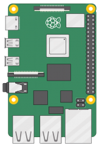
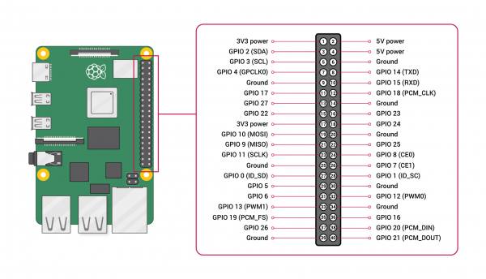

# Raspberry Pi 4B





## Soft reset / soft power down button

1. install `pip` in the RPi and then install the [RPi.GPIO](https://pypi.org/project/RPi.GPIO/) package. **Note: with `sudo` so later it will be accessible by `root`  and the python script will run from `/etc/rc.local`**:

```bash
(Rpi):$ sudo apt install python3-pip
(Rpi):$ sudo pip install RPi.GPIO
```

2. To avoid [this error](https://raspberrypi.stackexchange.com/questions/40105/access-gpio-pins-without-root-no-access-to-dev-mem-try-running-as-root), add the user to the `gpio` group and check that the device file `/dev/gpiomem` has the correct permissions:

```bash
(RPi):$ sudo adduser mhered gpio
(Rpi):$ ls -l /dev/gpiomem
crw-rw---- 1 root gpio 244, 0 Dec 28 22:51 /dev/gpiomem
```

​	If it doesn't, then set the correct permissions as follows

```bash
(Rpi):$ sudo chown root.gpio /dev/gpiomem
(Rpi):$ sudo chmod g+rw /dev/gpiomem
```

​	This needs to be repeated after every reboot so we will add these commands to the end of `/etc/rc.local` 

3. Wire the button to pins 9 (GND) and 11 (GPIO17 - INPUT). Note that the input pin is pulled HIGH by default so pushing it yields LOW.

4. Write the python script that listens for the button: [../code/button/safe_shutdown.py](../code/button/safe_shutdown.py)

​	For more details on wiring and the script refer to:

* https://www.electroniclinic.com/how-to-reset-or-shutdown-raspberry-pi-using-a-button/

* https://learn.sparkfun.com/tutorials/raspberry-pi-safe-reboot-and-shutdown-button/all
* https://raspberrypi.stackexchange.com/questions/69194/using-gpiozero-button-for-2-functions-long-short-press

5. Create `/etc/rc.local`:

```bash
#!/bin/sh -e
#
# File /etc/rc.local
# created by MH on 28.01.2023
#
# This script is executed at the end of each multiuser runlevel.
# Ensure that the script will "exit 0" on success or any other
# value on error.
#
# To enable or disable this script, just change the execution
# bits.
#
# By default, this script does nothing.


# Set permissions for dev/gpiomem
chown root.gpio /dev/gpiomem
chmod g+rw /dev/gpiomem

# run in the background the script that listens for the safe reset/shutdown button
/usr/bin/python3 /home/mhered/manolobot/code/button/safe_shutdown.py &

exit 0
```

5. Give it execution permission:

```bash
(Rpi):$ sudo chmod +x /etc/rc.local
```

Sources on playing with `/etc/rc.local`:

* https://learn.sparkfun.com/tutorials/how-to-run-a-raspberry-pi-program-on-startup 
* https://linuxhint.com/use-etc-rc-local-boot/ 
