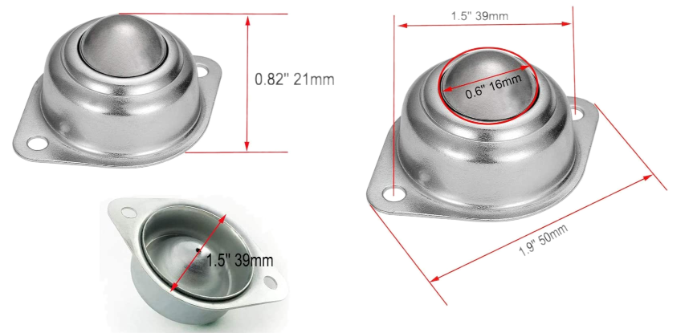

# Chassis

* 290 x 190 x 124 mm Keeeper Hubert + Hilda plastic storage box with tray:  [Amazon](https://www.amazon.de/keeeper-Hubert-Hilda-Storage-Transparent/dp/B092JKYLW5?ref_=ast_sto_dp)
* Caster ball [Amazon](https://www.amazon.es/dp/B09MLVQWL7?_encoding=UTF8&psc=1&ref_=cm_sw_r_cp_ud_dp_PQB2K3KK5H9V853M14GN)

* 2 sets of brass spacers M2.5 2: 20mm and 11mm
* Aluminium profile L shaped 30mm x 17mm x 2mm thickness, cut to 2000mm length
* M3 bolts, washers & nuts

