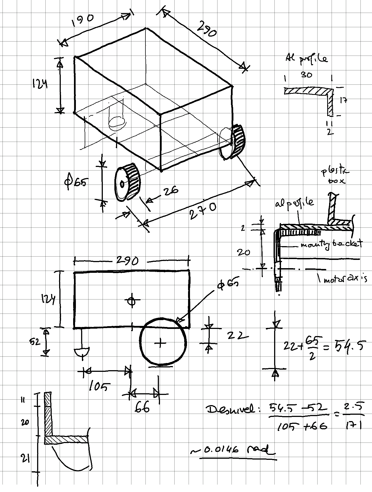

# Chassis

* 290 x 190 x 124 mm Keeeper Hubert + Hilda plastic storage box with tray:  [Amazon](https://www.amazon.de/keeeper-Hubert-Hilda-Storage-Transparent/dp/B092JKYLW5?ref_=ast_sto_dp)
* Caster ball [Amazon](https://www.amazon.es/dp/B09MLVQWL7?_encoding=UTF8&psc=1&ref_=cm_sw_r_cp_ud_dp_PQB2K3KK5H9V853M14GN). Ball diameter 0.6" (16mm)

* 2 sets of brass spacers M2.5 2: 20mm and 11mm
* Aluminium profile L shaped 30mm x 17mm x 2mm thickness, cut to 2000mm length
* M3 bolts, washers & nuts

## 3D printed parts
### LD06 mount
* [Minipupper Oak-D-Lite & Lidar mount](https://www.thingiverse.com/thing:5374323)
* [LDRobot LD06 360 LiDAR Module & Raspberry PI Mounting Bracket](https://grabcad.com/library/ldrobot-ld06-360-lidar-module-raspberry-pi-mounting-bracket-1)
* [The original LD06 baseplate from my my minipupper repo](https://github.com/mhered/minipupper_fun/tree/main/assets/CAD)

### Pi camera mount
* [BEST Micro Apex GO PRO Mount](https://www.thingiverse.com/thing:4890862)
* [Case Raspberry Pi Camera V2 (universal mounting) and GoPro holder adapter](https://www.thingiverse.com/thing:3610624)
* [Pi Camera Mount](https://www.thingiverse.com/thing:3411450)
