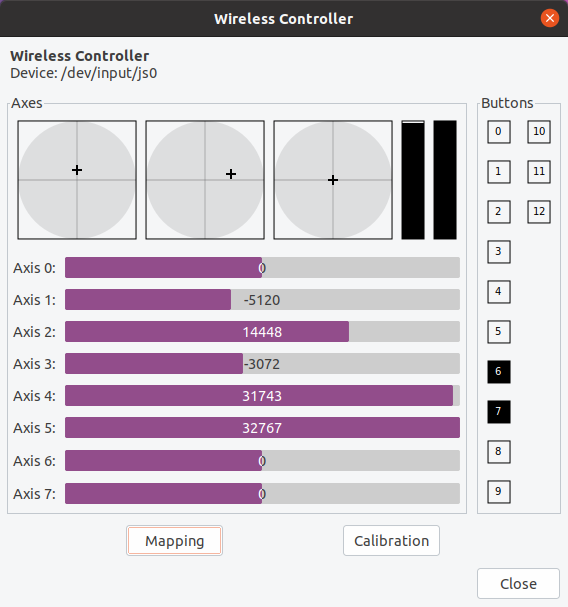

# Game pad setup

This section is largely based in [this article from Articulated Robotics](https://articulatedrobotics.xyz/mobile-robot-14a-teleop/)

I use an old PS4-compatible controller by [BINBOK](https://binbok.com/) (I got it bundled with Minipupper). 8 axes, 13 buttons.

1. Install software (Note: `libcanberra` is to fix the error message `Failed to load module "canberra-gtk-module"` when running `jstest-gtk` see [here](https://raspberryparatorpes.net/dudas/como-arreglar-el-error-gtk-message-failed-to-load-module-canberra-gtk-module/)):

```bash
$ sudo apt update
$ sudo apt upgrade
$ sudo apt install joystick jstest-gtk evtest
$ sudo apt-get install libcanberra-gtk-module libcanberra-gtk0
```

2. Connect controller via USB to charge.
3. Disconnect USB. Press HOME + SHARE until the light flashes White to pair. 
4. Open Bluetooth Settings Blue light click on Wireless Controller to Connect. Light turns Blue.


5. Test it works with:

```bash
$ evtest
No device specified, trying to scan all of /dev/input/event*
Not running as root, no devices may be available.
Available devices:
/dev/input/event18:	Wireless Controller
Select the device event number [0-18]: 18
Input driver version is 1.0.1
Input device ID: bus 0x5 vendor 0x54c product 0x5c4 version 0x8100
Input device name: "Wireless Controller"
Supported events:
  Event type 0 (EV_SYN)
  Event type 1 (EV_KEY)
    Event code 304 (BTN_SOUTH)
    Event code 305 (BTN_EAST)
    Event code 307 (BTN_NORTH)
    Event code 308 (BTN_WEST)
    Event code 310 (BTN_TL)
    Event code 311 (BTN_TR)
    Event code 312 (BTN_TL2)
    Event code 313 (BTN_TR2)
    Event code 314 (BTN_SELECT)
    Event code 315 (BTN_START)
    Event code 316 (BTN_MODE)
    Event code 317 (BTN_THUMBL)
    Event code 318 (BTN_THUMBR)
  Event type 3 (EV_ABS)
    Event code 0 (ABS_X)
      Value    128
      Min        0
      Max      255
      Flat      15
    Event code 1 (ABS_Y)
      Value    128
      Min        0
      Max      255
      Flat      15
    Event code 2 (ABS_Z)
      Value      0
      Min        0
      Max      255
      Flat      15
    Event code 3 (ABS_RX)
      Value    128
      Min        0
      Max      255
      Flat      15
    Event code 4 (ABS_RY)
      Value    128
      Min        0
      Max      255
      Flat      15
    Event code 5 (ABS_RZ)
      Value      0
      Min        0
      Max      255
      Flat      15
    Event code 16 (ABS_HAT0X)
      Value      0
      Min       -1
      Max        1
    Event code 17 (ABS_HAT0Y)
      Value      0
      Min       -1
      Max        1
  Event type 4 (EV_MSC)
    Event code 4 (MSC_SCAN)
  Event type 21 (EV_FF)
    Event code 80 (FF_RUMBLE)
    Event code 81 (FF_PERIODIC)
    Event code 88 (FF_SQUARE)
    Event code 89 (FF_TRIANGLE)
    Event code 90 (FF_SINE)
    Event code 96 (FF_GAIN)
Properties:
Testing ... (interrupt to exit)
Event: time 1672950462.408306, type 3 (EV_ABS), code 4 (ABS_RY), value 116
Event: time 1672950462.408306, -------------- SYN_REPORT ------------
Event: time 1672950462.409528, type 3 (EV_ABS), code 4 (ABS_RY), value 113
Event: time 1672950462.409528, -------------- SYN_REPORT ------------
Event: time 1672950462.468288, type 3 (EV_ABS), code 4 (ABS_RY), value 122
Event: time 1672950462.468288, -------------- SYN_REPORT ------------
Event: time 1672950462.493314, type 3 (EV_ABS), code 4 (ABS_RY), value 128
Event: time 1672950462.493314, -------------- SYN_REPORT ------------
Event: time 1672950462.621931, type 3 (EV_ABS), code 1 (ABS_Y), value 118
Event: time 1672950462.621931, -------------- SYN_REPORT ------------
Event: time 1672950462.623186, type 3 (EV_ABS), code 1 (ABS_Y), value 58
....
```

6. Alternatively,`jstest-gtk` provides a nicer GUI for testing which also allows reassigning keys and calibrating, not sure what use it has...

```bash
$ jstest-gtk
```




Note: The touchpad in the gamepad controls the Mouse

7. To switch off Press HOME button >10s

## Gamepad in ROS

`joy_node` listens to the Linux drivers of the gamepad and publishes `sensor_msgs/Joy` messages

To test it:

```bash
(Terminal 1):$ ros2 run joy joy_enumerate_devices
Joystick Device ID : Joystick Device Name
-----------------------------------------
                 0 : Wireless Controller
(Terminal 1):$ ros2 run joy joy_node
[INFO] [1672951873.296497573] [joy_node]: Opened joystick: Wireless Controller.  deadzone: 0.050000
^C[INFO] [1672952000.449538162] [rclcpp]: signal_handler(signal_value=2)

```


```bash
(Terminal 2):$ ros2 topic echo /joy
header:
  stamp:
    sec: 1672951997
    nanosec: 451926026
  frame_id: joy
axes:
- -0.0
- -0.0
- 1.0
- -0.0
- -0.0
- 1.0
- 0.0
- 0.0
buttons:
- 0
- 0
- 0
- 0
- 0
- 0
- 0
- 0
- 0
- 0
- 0
- 0
- 0
---
...
```

List of parametes:

```
/joy_node:
  autorepeat_rate
  coalesce_interval_ms
  deadzone
  device_id
  device_name
  sticky_buttons
  use_sim_time
```

