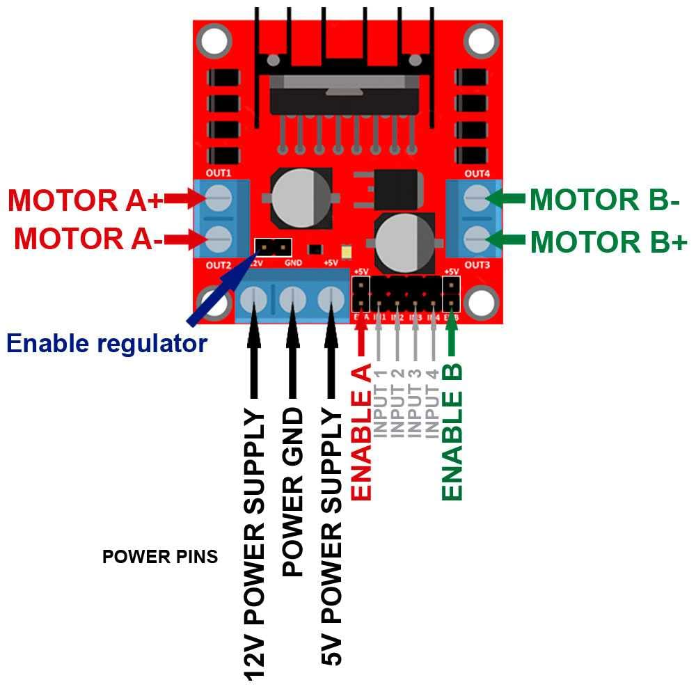

# L298N Motor driver

 Dimensions: ‎ 5 x 5 x 3 cm

Weight: 27 grams 

Motor output voltage	5V – 35V
Motor output voltage (Recommended)	7V – 12V
Logic input voltage	5V – 7V
Continuous current per channel	2A
Max Power Dissipation	25W

## Tutorials

* [Interface L298N DC Motor Driver Module with Arduino](https://lastminuteengineers.com/l298n-dc-stepper-driver-arduino-tutorial/)

* [L298N Motor Driver – Arduino Interface, How It Works, Codes, Schematics](https://howtomechatronics.com/tutorials/arduino/arduino-dc-motor-control-tutorial-l298n-pwm-h-bridge/)

* [How to use the L298N Motor Driver ](https://create.arduino.cc/projecthub/ryanchan/how-to-use-the-l298n-motor-driver-b124c5)

## Pinout

