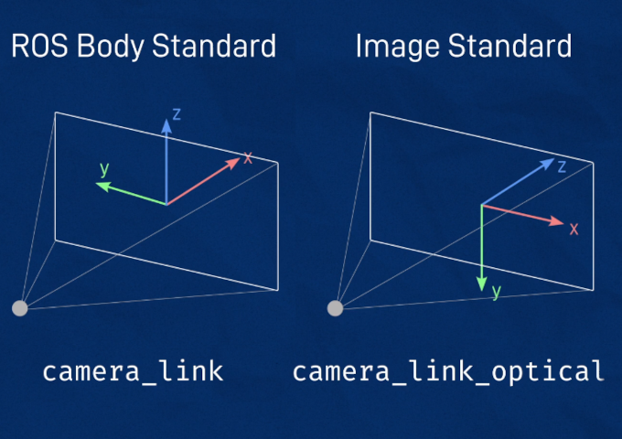

# Cameras in ROS

cfr. https://articulatedrobotics.xyz/mobile-robot-9-camera/

Conversion between field of view and focal length:
$$
fov = 2 atan (sensorwidth/2 focallength)
$$
Image axes: 

x: left to right

y: top to bottom

z: into the page / away from the camera

A driver node talks to the camera hardware and publishes:

* `sensor_msgs/Image` messages with the unprocessed images to topic `/my_camera/image_raw` 
*  `sensor_msgs/CompressedImage` messages with compressed images to topic `/my_camera/image_raw/compressed`

*  `sensor_msgs/CameraInfo` messages with calibration, distortion coefficients needed to interpret the raw image data to topic `/my_camera/camera_info` 

ROS Library `image_transport` provides tools to convert from uncompressed to compressed images. ROS packages `image_proc/image_pipelines` publish topics such as `image_color` or `image_rect` using `camera_info` which are more convenient to to be used by algorithms

All topics in `camera_link_optical` are associated to TF frame which is an empty link used as alias and related to `camera_link` with a rotation `rpy="${-pi/2} 0 ${-pi/2}"`



## Visualizing in RVIZ:

1. Launch RVIZ:

```bash
$ rviz2
```

2. Add **Image** 

3. Select Topic `/camera/image_raw`

Install plugins for image compression to see also `/camera/image/compressed`:

```bash
$ sudo apt install ros-foxy-image-transport-plugins
```

Unfortunately RVIZ does not suport compressed, we need to install also RQT image view:

```bash
$ sudo apt install ros-foxy-rqt-image-view
```

Launch it with:

```bash
$ ros2 run rqt_image_view rqt_image_view
```


## How to republish compressed / raw topic if not implemented in the driver

List existing transports:

```bash
$ ros2 run image_transport list_transports 
Declared transports:
image_transport/compressed
image_transport/compressedDepth
image_transport/raw
image_transport/theora

Details:
----------
"image_transport/compressed"
 - Provided by package: compressed_image_transport
 - Publisher: 
      This plugin publishes a CompressedImage using either JPEG or PNG compression.
    
 - Subscriber: 
      This plugin decompresses a CompressedImage topic.
    
----------
"image_transport/compressedDepth"
 - Provided by package: compressed_depth_image_transport
 - Publisher: 
      This plugin publishes a compressed depth images using PNG compression.
    
 - Subscriber: 
      This plugin decodes a compressed depth images.
    
----------
"image_transport/raw"
 - Provided by package: image_transport
 - Publisher: 
      This is the default publisher. It publishes the Image as-is on the base topic.
    
 - Subscriber: 
      This is the default pass-through subscriber for topics of type sensor_msgs/Image.
    
----------
"image_transport/theora"
 - Provided by package: theora_image_transport
 - Publisher: 
      This plugin publishes a video packet stream encoded using Theora.
    
 - Subscriber: 
      This plugin decodes a video packet stream encoded using Theora.

```

To republish topics from one type to another:

```bash
$ ros2 run image_transport republish compressed raw --ros-args -r in/compresseed:=/camera/image_raw/compressed -r out:=/camera/image_raw/uncompressed

```

```bash
$ ros2 run image_transport republish raw compressed --ros-args -r in:=/camera/image_raw -r out/compressed:=/camera/image_raw/compressed
```

## 

## Setup picamera in Rpi

### First try

Tutorial: https://larrylisky.com/2016/11/24/enabling-raspberry-pi-camera-v2-under-ubuntu-mate/ rather old, from 2016

https://wesleych3n.medium.com/enable-camera-in-raspberry-pi-4-with-64-bit-ubuntu-21-04-d97ce728db9d

Note: Connect ribbon with blue side facing the USB connectors

```bash
(RPi)$ sudo apt-get update
(RPi)$ sudo apt-get upgrade
```

Installation of `raspi-config` failed

```bash
(RPi)$ sudo apt-get install raspi-config rpi-update
Reading package lists... Done
Building dependency tree       
Reading state information... Done
E: Unable to locate package raspi-config
E: Unable to locate package rpi-update
```

On the other hand the file `/boot/firmware/config.txt` already had the lines:

```
start_x=1
gpu_mem=128
```

`/dev/video0/` was detected:

```bash
$ ls -ltrh /dev/video*
crw-rw----+ 1 root video 81, 0 Apr 21  2022 /dev/video13
crw-rw----+ 1 root video 81, 1 Apr 21  2022 /dev/video10
crw-rw----+ 1 root video 81, 2 Apr 21  2022 /dev/video14
crw-rw----+ 1 root video 81, 4 Apr 21  2022 /dev/video16
crw-rw----+ 1 root video 81, 3 Apr 21  2022 /dev/video15
crw-rw----+ 1 root video 81, 7 Apr 21  2022 /dev/video12
crw-rw----+ 1 root video 81, 6 Apr 21  2022 /dev/video0
crw-rw----+ 1 root video 81, 5 Apr 21  2022 /dev/video11

```

And `cheese` was already installed

I tested with `cheese`  (cfr. https://linuxconfig.org/how-to-test-webcam-on-ubuntu-20-04-focal-fossa) and the camera works but is very slow, has low resolution, and weird colors.

This article: https://raspberrypi.stackexchange.com/questions/114035/picamera-and-ubuntu-20-04-arm64 recommends using `opencv` but mentions there is active development to support `libcamera`? in ubuntu arm 64b.

However this guy claims `raspiconfig` can be installed in Ubuntu Mate: https://ubuntu-mate.community/t/install-raspi-config-on-ubuntu-mate-20-10-and-higher/23974

### Second try

Install sfw in Rpi:

```bash
(Rpi):$ sudo apt update
(Rpi):$ sudo apt upgrade
(Rpi):$ sudo apt install libraspberrypi-bin v4l-utils ros-foxy-v4l2-camera
```

Check your user is in the `video` group:

```bash
(Rpi):$ groups
mhered adm dialout cdrom sudo dip video plugdev input lxd lpadmin sambashare spi i2c gpio
```

Otherwise add your user to the `video` group it with:

```bash
(Rpi):$ sudo usermod -aG video mhered
(Rpi):$ reboot
```

Check camera is connected:

```bash
(Rpi):$ vcgencmd get_camera
supported=1 detected=1
```

Stream with:

```bash
(Rpi):$ raspistill -k
```

Quit with `x`

Check if `v4l` (video for linux) can see the camera with:

```bash
(Rpi):$ v4l2-ctl --list-devices
bcm2835-codec-decode (platform:bcm2835-codec):
	/dev/video10
	/dev/video11
	/dev/video12
	/dev/media1

bcm2835-isp (platform:bcm2835-isp):
	/dev/video13
	/dev/video14
	/dev/video15
	/dev/video16
	/dev/media0

mmal service 16.1 (platform:bcm2835-v4l2):
	/dev/video0
```

We install image_transport library and rqt_image_view:

```bash
(Rpi):$ sudo apt install ros-foxy-image-transport-plugins ros-foxy-rqt-image-view
```

Launch driver node:

```bash
(Rpi):$ ros2 run v4l2_camera v4l2_camera_node --ros-args -p image_size:="[640,480]" -p camera_frame_id:=camera_link_optical
```

which is equivalent to the following `camera.launch.py` launch file 

```python
import os

from launch import LaunchDescription
from launch_ros.actions import Node

def generate_launch_description():

    return LaunchDescription([

        Node(
            package='v4l2_camera',
            executable='v4l2_camera_node',
            output='screen',
            parameters=[{
                'image_size': [640,480],
                'camera_frame_id': 'camera_link_optical'
                }]
    )
    ])
```

Note: To run the launch file first we have to pull the changes to the local repo in the robot, make a workspace, symlink the repo and build the package (I had done all this in the PC but not yet in the robot):

```bash
$ mkdir ~/dev_ws && cd ~/dev_ws
$ mkdir src && cd src
ln -s ~/manolobot/manolobot_uno/ ~/dev_ws/src/
$ cd ..
$ colcon build --symlink-install
$ source install/setup.bash
$ ros2 launch manolobot_uno camera.launch.py
```

Then launch `rqt_image_view` from the PC:

```bash
(PC):$ ros2 run rqt_image_view rqt_image_view
```

Note: it broadcasts only over `/image_raw_compressed/`

## Next steps

- [ ] modify camera launch file to also convert compressed to raw images and broadcast them (maybe from PC?)
- [ ] Explore v4l2 repo: https://gitlab.com/boldhearts/ros2_v4l2_camera/-/tree/foxy 
- [ ] Explore: https://medium.com/swlh/raspberry-pi-ros-2-camera-eef8f8b94304 includes ROS2 in Raspbian, v4l2, and tips about going further with opencv and ROS2 tensorflow lite
