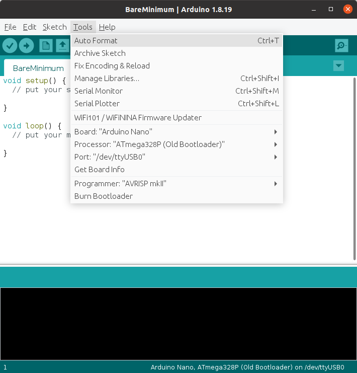

# Articulated Robotics - Getting Ready for ROS series 

[Getting ready to Build Robots with ROS youtube playlist](https://www.youtube.com/playlist?list=PLunhqkrRNRhYYCaSTVP-qJnyUPkTxJnBt)

8+1 videos covering the setup and an overview of ROS2, TF, URDF and gazebo

## (#01) What we need 

Link to blog post: [Getting Ready for ROS Part 1: What you need](https://articulatedrobotics.xyz/ready-for-ros-1-what-you-need/)

### Skills

Basic Admin: install and configure OS
Move around in Linux
Git for version tracking
Programming & Compiling
Basic electronics: programming an arduino, soldering, connecting a breadboard

### Hardware setup
How to balance small, low energy, powerful and cheap? split computing between 2 paired computers:
* a small onboard computer on the robot (RPi): takes sensor data, sends for processing over network to base station. Receives results and send signals to actuators
* a powerful off-board base station and development machine (mid-range laptop): runs algorithms for processing, takes joystick input, provides visualization and doubles as development machine for coding comfotsably

Docker and virtual machines are fiddly better full Ubuntu installation

### Software
- [x] LTS ROS 2 Foxy Fitzroy is compatible with Ubuntu 20.04 focal fossa (ubuntu mate 64 bits https://ubuntu-mate.org/download). Today latest is ROS 2 Humble and Ubuntu 22.04 Jellyfish.

- [x] version control sfw: git in both rpi and laptop

``` bash
$ sudo apt install git
```
- [x] code editor: vscode only needed on laptop

``` bash
$ sudo snap install --classic code
```
- [x] recommended install also VS code [remote development extension pack](https://code.visualstudio.com/docs/remote/ssh) to code on RPi without a screen

- [x] arduino IDE on both computers ([instructions](https://docs.arduino.cc/software/ide-v1/tutorials/Linux)):
  - [x] Download [ARM Linux 64 bits](https://downloads.arduino.cc/arduino-1.8.19-linuxaarch64.tar.xz) and [Linux 64 bits](https://downloads.arduino.cc/arduino-1.8.19-linux64.tar.xz) versions of IDE 1.8.19 from the [Arduino download page](https://www.arduino.cc/en/software)
  - [x] On laptop, extract to a suitable location e.g. `~/Applications/arduino-1.8.19/`
  - [x] From inside the folder,  run the install script that creates desktop links:
  
  ```bash
     $ sudo sh install.sh
  ```
  
  - [x] Open the IDE, under **Tools** select **Board:"Arduino Nano"**, **Processor:"ATmega328P (OldBootloader)"** and **Port:"/dev/ttyUSB0"**. Note: choosing the wrong processor gives [this error](https://support.arduino.cc/hc/en-us/articles/4401874331410#avrdude-stk500_recv-and-stk500_getsync)
  
  
  
  - [x] If it still does not connect add the user to the `dialout` group:
  
  ```
  $ ls -l /dev/ttyUSB*
  crw-rw---- 1 root dialout 188, 0 Nov 20 13:47 /dev/ttyUSB0
  $ sudo usermod -a -G dialout <username>
  ```
  
  Tested with **Blink** and **AnalogReadSerial** under **File -> Examples -> 01.Basics** 

### Other tools
- [x] 12V bench power supply
- [ ] Battery charger
- [x] Multimeter
- [x] Soldering iron and solder
- [x] Crimp tools, screwdrivers, Pliers, tieraps, screws,
- [x] rotary tool
- [ ] 3D printer

## (#02) Network setup
Link to blog post: [Getting Ready for ROS Part 2: Networking](https://articulatedrobotics.xyz/ready-for-ros-2-networking/)

Network is needed to remotely control our robot, have robots work together and split computation over multiple machines. ROS provides the protocols, we just need to ensure all computers are in the same network. Requisites:

* Fast reliable connection between robot and laptop
* Internet access to install sfw and back-up in git
* Control over the network e.g. to set up fixed IP addresses

3 options for architecture:

* Existing network: rpi and laptop connected to the router. Easy but not portable, lacks control (DHCP/static IP, network congestion, dropouts etc), may lead to ROS conflicts when using more than one robot
* Access point network: configure laptop to generate wifi network, robot connects to it. Flexible but requires effort to configure, a second wifi card, complex with more than one base computer.
* Dedicated network with a travel router. Preferred.

- [x] Install `ssh` on RPi using keyboard mouse and monitor

```bash
(RPi):$ sudo apt install openssh-server
```

- [x] Get the local IP address of RPi with

```bash
(RPi):$ ip addr
```

- [x] To access RPi terminal remotely from laptop:

```bash
(laptop):$ ssh <pi_username>@<pi_ip_address> # in particular ssh mhered@192.168.8.105

```
- [ ] Write a config file with [`netplan`](https://netplan.io) **Note: my laptop does not have Ethernet port!**

Other tools:

* `scp` for file transfer
* X forwarding to run GUIs remotely
* VS code [remote development extension pack](https://code.visualstudio.com/docs/remote/ssh)

## (#03) Install ROS

Link to blog post: [Getting Ready for ROS Part 3: Installing ROS](https://articulatedrobotics.xyz/ready-for-ros-3-installing-ros/)
Install ROS on both `laptop` and `RPi`:

- [X] Check UTF-8 is set and that the Ubuntu universe repo is enabled with: 
```bash
$ locale
...
$ apt-cache policy | grep universe
```
The second should result in something like:
```
500 http://ports.ubuntu.com/ubuntu-ports focal/universe arm64 Packages
     release v=20.04,o=Ubuntu,a=focal,n=focal,l=Ubuntu,c=universe,b=arm64
```
Note: cfr. the [ROS Foxy installation guide](https://docs.ros.org/en/foxy/Installation/Ubuntu-Install-Debians.html) if more details needed. 
- [X] Add ROS2 apt repo to the system with:
```bash
$ sudo apt update && sudo apt install curl gnupg2 lsb-release
$ sudo curl -sSL https://raw.githubusercontent.com/ros/rosdistro/master/ros.key  -o /usr/share/keyrings/ros-archive-keyring.gpg
$ echo "deb [arch=$(dpkg --print-architecture) signed-by=/usr/share/keyrings/ros-archive-keyring.gpg] http://packages.ros.org/ros2/ubuntu $(source /etc/os-release && echo $UBUNTU_CODENAME) main" | sudo tee /etc/apt/sources.list.d/ros2.list > /dev/null
```
- [X] Install `ros2` and `colcon` and add sourcing of the ROS2 environment to `~/.bashrc` with:
```bash
$ sudo apt update && sudo apt upgrade
$ sudo apt install ros-foxy-desktop
$ sudo apt install python3-colcon-common-extensions
$ echo "source /opt/ros/foxy/setup.bash" >> ~/.bashrc
$ source ~/.bashrc
```

- [X] Test communication between a node written in C++ running on the laptop and a python node running on RPi: 
```bash
(laptop:)$ ros2 run demo_nodes_cpp talker
...
[INFO] [1662750396.990408713] [talker]: Publishing: 'Hello World: 67'
[INFO] [1662750397.990414028] [talker]: Publishing: 'Hello World: 68'
[INFO] [1662750398.990288416] [talker]: Publishing: 'Hello World: 69'
...
```
```bash
(RPi:)$ ros2 run demo_nodes_py listener
...
[INFO] [1662750392.965285945] [listener]: I heard: [Hello World: 63]
[INFO] [1662750393.965151014] [listener]: I heard: [Hello World: 64]
[INFO] [1662750394.965403701] [listener]: I heard: [Hello World: 65]
...
```
Success!

## (#04) 10 concepts about ROS

Link to blog post: [Getting Ready for ROS Part 4: ROS Overview (10 concepts you need to know)](https://articulatedrobotics.xyz/ready-for-ros-4-ros-overview/)

1. ROS Distributions
2. Nodes
3. Topics and Messages
4. Services
5. Node Arguments (Parameters and Remapping)
6. Launch Files
7. Packages
8. System Install (the underlay)
9. Workspaces/Overlays
10. QoS

## (#05) Create a package

Link to blog post: [Getting Ready for ROS Part 5: Making your First Package](https://articulatedrobotics.xyz/ready-for-ros-5-packages/)

1. Create a workspace 
2. Create a package
3. Build it
4. Upload to git
5. Pull from git to the robot
6. Test it 

## (#06) The Transform System (TF)

Link to blog post: [Getting Ready for ROS Part 6: The Transform System (TF)](https://articulatedrobotics.xyz/ready-for-ros-6-tf/)

* Played with static transforms: `$ ros2 run tf2_ros static_transform_publisher x y z yaw pitch roll parent_frame child_frame` with translations and rotations (in radians) processed in the order they appear in the command.

* to open RVIZ: `$ ros2 run rviz2 rviz2` or simply `$ rviz2`

* install xacro and joint state publisher GUI:

  ```bash
  $ sudo apt install ros-foxy-xacro ros-foxy-joint-state-publisher-gui
  ```

* play with dynamic transforms

  - `robot_state_publisher` node takes URDFs and publishes transforms in `/tf` and `/tf_static` topics. We need to publish `/joint_states` messages e.g. using `joint_state_publisher_gui`

  - It takes as parameter the complete contents (!) of the URDF file, which is why we add `"$( xacro /path-to-file )"`:


```bash
(Terminal 1):$ ros2 run robot_state_publisher robot_state_publisher --ros-args -p robot_description:="$( xacro ~/example_robot.urdf.xacro )"
```

```bash
(Terminal 2):$ ros2 run joint_state_publisher_gui joint_state_publisher_gui
```

* tried debugging with `view_frames`

  * Similar to `rqt_tf_tree` from ROS1, which does not work in ROS2
  * Run `view_frames` with:

  ```bash
  $ ros2 run tf2_tools view_frames.py
  ```

  * Listens to transforms 5 secs then writes a `frames.gv` and `frames.pdf` to the local directory

## (#07) Describing a robot with URDF

Link to blog post: [Getting Ready for ROS Part 7: Describing a robot with URDF](https://articulatedrobotics.xyz/ready-for-ros-7-urdf/)

* URDF: Unified Robot Description Format, based on XML

* Describes the robot as a tree of **Links** connected by **Joints** - where each Link may have many childs but has only one parent (tree structure without closed loops)
* Root tag of the XML is `robot`, its only attribute is `name`
* We assign a **Link** to every part that moves relative to others or can be physically detached (hence will require calibration). A **Link** is defined by a `name` and also its `visual`, `collision` and `inertial` properties. We can define multiple `visual`, `collision` tags to define complex shapes.
* **Joints** define the position and orientation of the child with respect to the parent Link. 4 most common Joint types are `revolute` (rotate with limits), `continuous` (rotate freely), `prismatic` (linear slider) and  `fixed`. a **Joint** is defined by `name`,` type`, `parent` and `child`, `origin` (initial position),  and for non fixed joints also`axis`, and `limits` (`min`and `max` are position in rad or m, `velocity` is max in rad/s or m/s and `effort` is max in N or Nm). 
* Naming convention: `arm_link` is the child link in`arm_joint`

```xml
<?xml xmlns:xacro="http://www.ros.org/wiki/xacro" version="1.0"?>
<robot name="example_urdf">
    <!-- example Link -->
    <link name="base_link">
    	<visual> what we see in RVIZ and gazebo
            <geometry></geometry> overall shape: box, cylinder, sphere or path to 3d mesh 
            <origin></origin> offset to geometry. Origin can be selected freely except for rotating Links that must have origin at pivot point.
            <material></material> color as RGB triplet or name of one defined previously 
        </visual>
        <collision> used for physics collision calculations. Copy & paste of visual or simplified for better performance.
            <geometry></geometry>
            <origin></origin>
        </collision>
        <inertial> for calculations of response to forces
            <mass></mass>
            <origin></origin> center of mass
            <inertia></inertia> rotational inertia matrix. approximated from primitives or calculated with CAD program for meshes
        </inertial>
    </link>
    
    <!-- example Joint -->
    <joint name="arm_joint" type = "revolute">
        <parent link="slider_link" />
        <child link="arm_link" />
        <origin xyz="0.25 0 0.12" rpy="0 0 0" />
        <axis xyz="0 -1 0" />
        <limit lower="0" upper="${pi/2}" velocity="100" effort="100">
    </joint>

</robot>
```

* `xacro` XML macro allows to include subfiles in a main file e.g to split into smaller reusable files. To enable it add `xmlns:xacro="http://www.ros.org/wiki/xacro"` to the `robot` tag. The include statement is e.g.: `<xacro:include filename="my_materials.xacro" />`

* That's why we normally process the raw URDF file(s) with xacro and feed it directly to the `robot_state_publisher` 

* Also has properties and mathematical operators e.g.  `<xacro:property name="r" value ="0.5" />` used later to define a cylinder  `<cylinder radius="${r}" length="${4*r}">`

* Also has macros that expand replacing parameters, e.g.:

  ```xml
  <xacro:macro name="inertial_box" params ="mass x y z *origin">
      <inertial>
          <xacro:insert_block name="origin" />
          <mass value="${mass}" />
          <inertia ixx="${(1/12) * mass * (y*y+z*z)}" etc />
      </inertial>
  </xacro:macro>
  ```

  Can be used as:

  ```xml
  <xacro:inertial_box mass="12" x="2" y="3" z="4">
      <origin xyz="0 2 4" rpy="0 0 0" />
  </xacro:inertial_box>
  ```

  And expands to:

  ```
      <inertial>
          <origin xyz="0 2 4" rpy="0 0 0" />
          <mass value="12" />
          <inertia ixx="25" etc />
      </inertial>
  ```


## (#08) Simulating with Gazebo

Link to blog post: [Getting Ready for ROS Part 8: Simulating with Gazebo](https://articulatedrobotics.xyz/ready-for-ros-8-gazebo/)
