# manolobot


## Bill of Materials


| Qty. | Item                                                  | Image                                                        | Description                                                  | Link                                                         | Price         |
| ---- | ----------------------------------------------------- | ------------------------------------------------------------ | ------------------------------------------------------------ | ------------------------------------------------------------ | ------------- |
| 2    | [12V DC  encoder motor kit](./motor_kit.md)           | 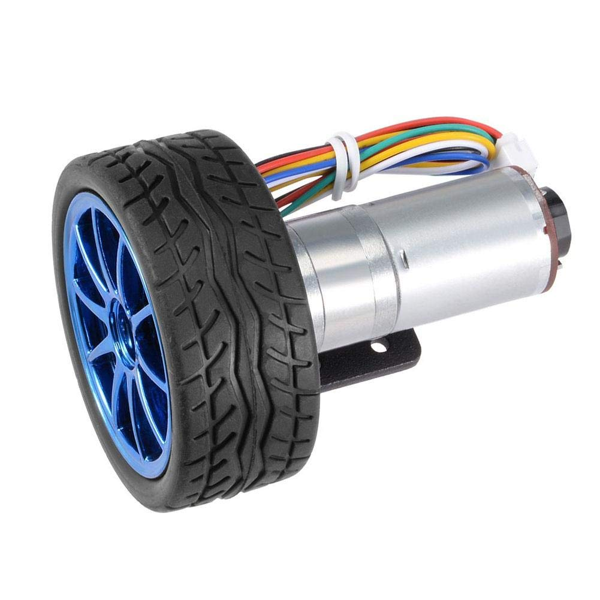 | 12V DC motor JGA25-371 with encoder, 130rpm reductor, 65mm wheel, coupling, mounting bracket | [Amazon](https://www.amazon.es/dp/B07WT22RNK?psc=1&ref=ppx_pop_dt_b_asin_title) | 30,33€        |
| 1    | [Raspberry Pi 4B]()                                   | 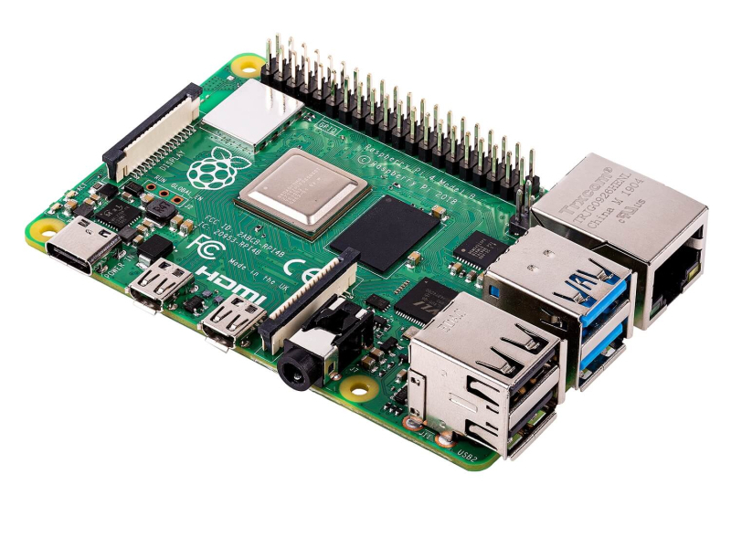 |                                                              | [Amazon]()                                                   |               |
| 1    | [Arduino Nano V3](./arduino_nano.md)                  | 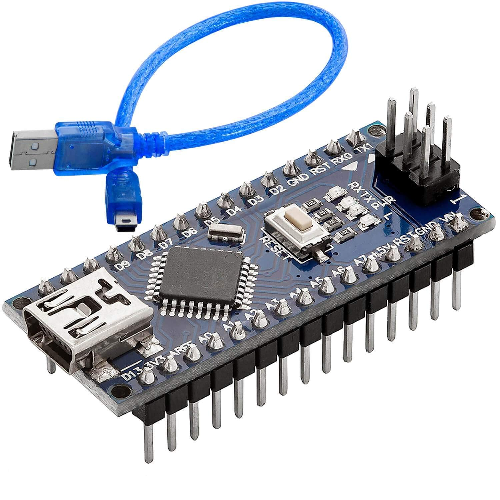              | AZDelivery Nano V3.0 with ATmega328 Chip CH340 soldered version with USB cable (Arduino Nano V3 clone) | [Amazon](https://www.amazon.es/gp/product/B01MS7DUEM/ref=ppx_yo_dt_b_asin_title_o00_s00?ie=UTF8&th=1) | 18,99€        |
| 1    | Arduino Nano Shell                                    | 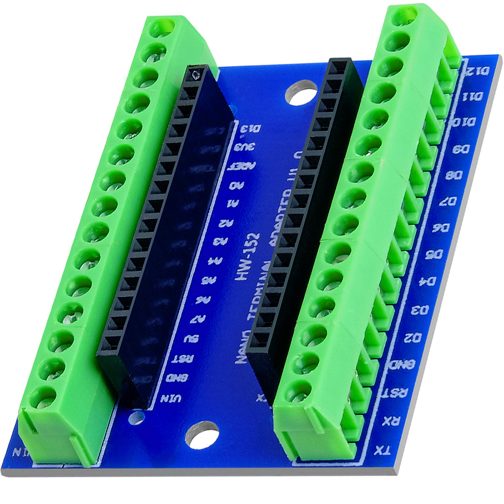            |                                                              | [Amazon](https://www.amazon.es/gp/product/B08T1ZXS7K/ref=ppx_yo_dt_b_asin_title_o00_s01?ie=UTF8&th=1) | 6,99€         |
| 1    | [L298N Motor driver](./motor_driver.md)               | 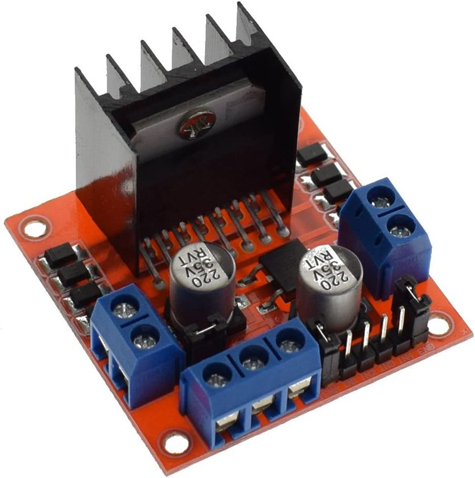              |                                                              | [Amazon](https://www.amazon.es/gp/product/B077NY9RY6/ref=ppx_yo_dt_b_asin_title_o00_s01?ie=UTF8&psc=1) | 9,99€ (2 uds) |
| 1    | [35W Buck-Boost DC Converter](./buck_converter.md)    | 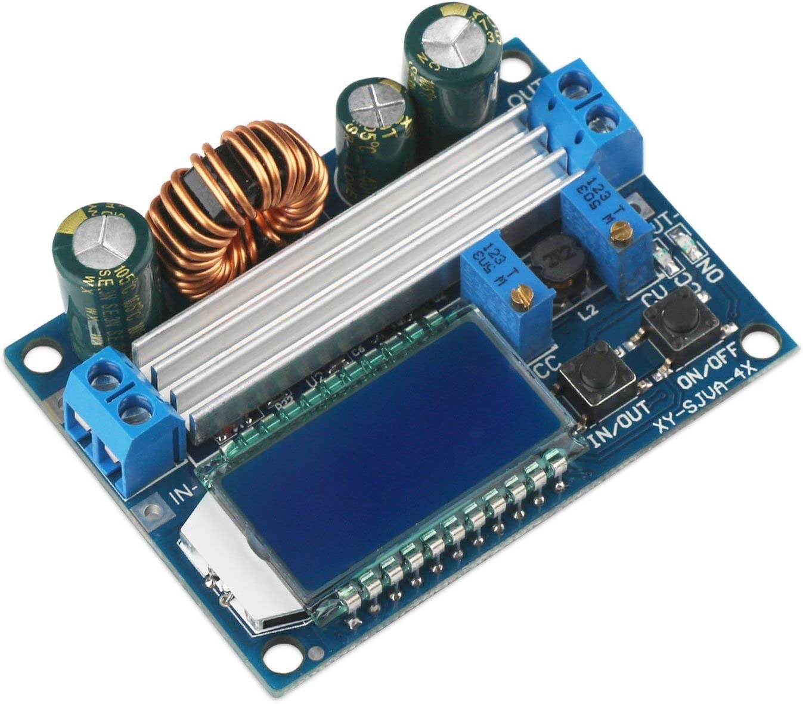          | ARCELI Buck-Boost Converter with display, DC 5.5-30V 12v to DC 0.5-30V  35W | [Amazon](https://www.amazon.es/gp/product/B07MY399GQ/ref=ppx_yo_dt_b_asin_title_o02_s00?ie=UTF8&psc=1) | 12,99€        |
| 1    | [5" 800x480 Resistive  Touchscreen](./touchscreen.md) | 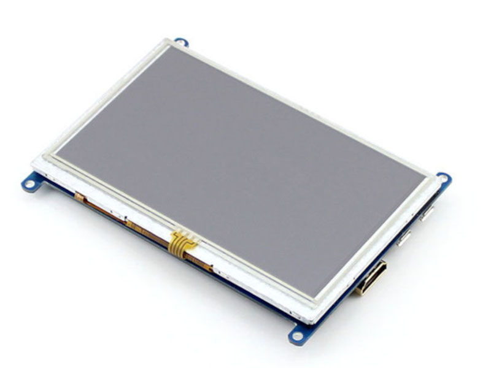     | Waveshare 5" HDMI LCD 800x480 Resistive Touchscreen TFT Display  with Case for Raspberry Pi 4 | [Amazon](https://www.amazon.es/dp/B07PLF8V8Y?psc=1&ref=ppx_pop_dt_b_product_details) | 52,99€        |
| 1    | [DTOF Lidar LD06](./LD06-lidar.md)                    | 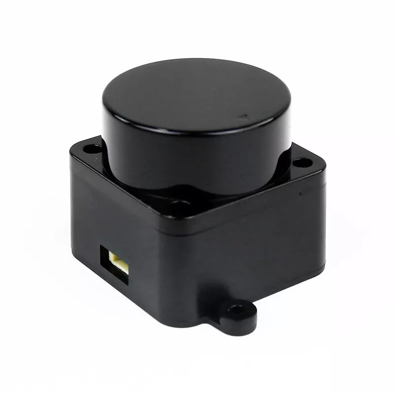                |                                                              | [Amazon](https://www.amazon.es/innomaker-integrado-omnidireccional-resistencia-LiDAR_LD06/dp/B08GJJX41D/ref=cm_cr_arp_d_product_top?ie=UTF8) | 99,99€        |
| 1    | [Pi Camera](pi_camera.md)                             | 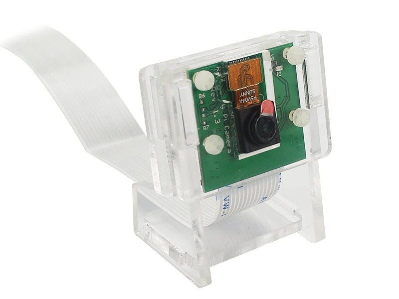                  | Pi Camera v1.3 with acrilic support                          |                                                              |               |

## First prototype (20/11/22)

### Notes

- 12V from bench power source
- A split takes the 12V to the buck converter and the motor driver.
- Buck converter takes 12V at IN+ /IN- and yields 5V at OUT+/OUT- to power the RPi
- RPi takes 5V at pin 4 (5V)/ pin 6(GND) - [How do I power my Raspberry Pi](https://robocraze.com/blogs/post/how-do-i-power-my-raspberry-pi)
- Arduino Nano powered from RPi via USB
- Motor Driver is powered by 12V at 12V/GND pins. 5V jumper is installed, 5V terminal not connected - Could I use this to power the RPi?
- OUT1/OUT2 are connected to the Red/White of the motor. The remaining 4 cables of the encoder are disconnected.
- Connecting the IN1 / IN2 to 5V (e.g. to the 5V pin of the Arduino Nano, cfr. [the Nano pinout in this tutorial](https://diyi0t.com/arduino-nano-tutorial/)) makes the Motor rotate CV / CCV  

### Diagram and overview


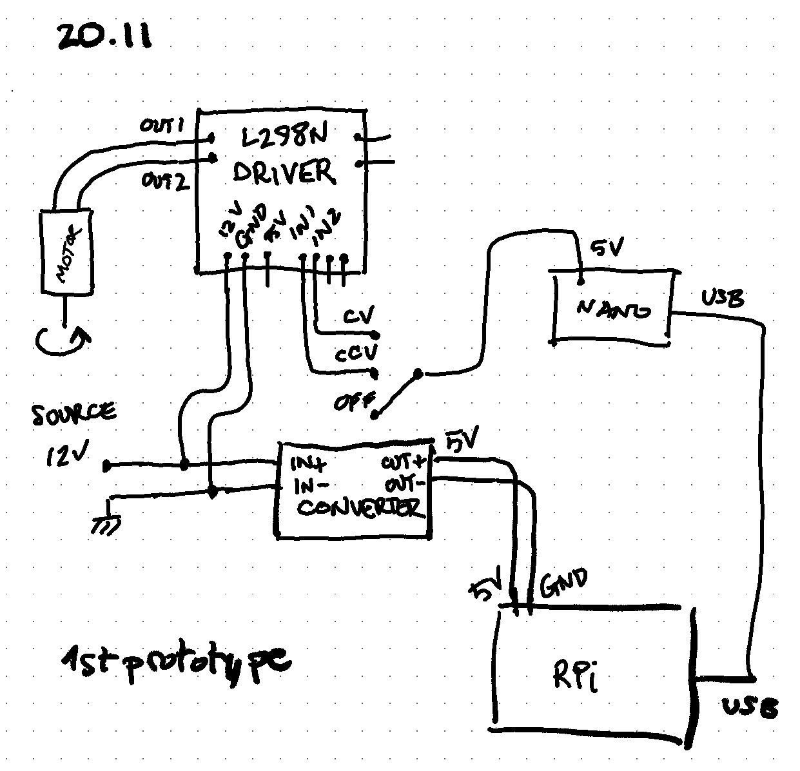

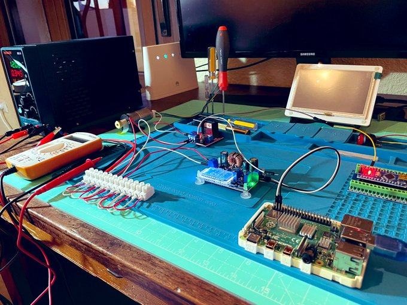

### Shutting down

Before switching off the power supply, SSH into the RPi to shut it down:

```bash
(RPi) $ sudo shutdown -h now
```

### Powering the adafruit USB hub

https://forums.adafruit.com/viewtopic.php?p=930206&hilit=external+power+usb+hub#p930206
