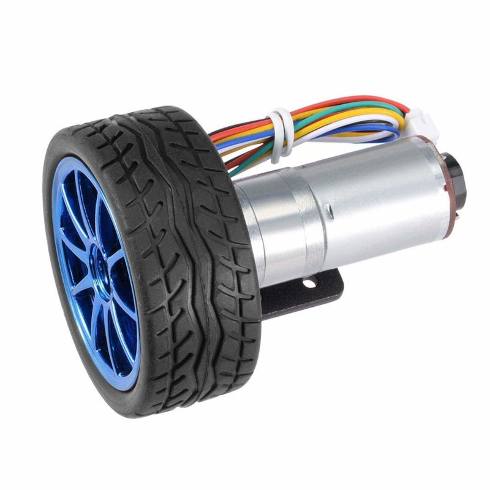
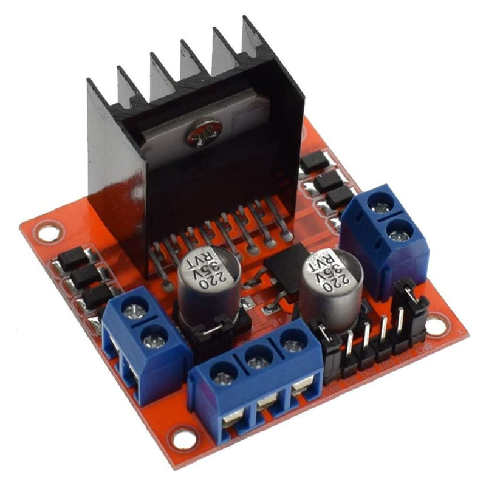

# manolobot


## Bill of Materials


| Qty. | Item                                                      | Image                                                        | Description                                                  | Link                                                         | Price         |
| ---- | --------------------------------------------------------- | ------------------------------------------------------------ | ------------------------------------------------------------ | ------------------------------------------------------------ | ------------- |
| 2    | [12V DC  encoder motor kit](./BOM/motor_kit.md)           |  | 12V DC motor JGA25-371 with encoder, 130rpm reductor, 65mm wheel, coupling, mounting bracket | [Amazon](https://www.amazon.es/dp/B07WT22RNK?psc=1&ref=ppx_pop_dt_b_asin_title) | 30,33€        |
| 1    | [Raspberry Pi 4B](./BOM/RPi_4B.md)                        |  |                                                              | [Amazon]()                                                   |               |
| 1    | [Arduino Nano V3](./BOM/arduino_nano.md)                  |             | AZDelivery Nano V3.0 with ATmega328 Chip CH340 soldered version with USB cable (Arduino Nano V3 clone) | [Amazon](https://www.amazon.es/gp/product/B01MS7DUEM/ref=ppx_yo_dt_b_asin_title_o00_s00?ie=UTF8&th=1) | 18,99€        |
| 1    | Arduino Nano Shell                                        |           |                                                              | [Amazon](https://www.amazon.es/gp/product/B08T1ZXS7K/ref=ppx_yo_dt_b_asin_title_o00_s01?ie=UTF8&th=1) | 6,99€         |
| 1    | [L298N Motor driver](./BOM/motor_driver.md)               |             |                                                              | [Amazon](https://www.amazon.es/gp/product/B077NY9RY6/ref=ppx_yo_dt_b_asin_title_o00_s01?ie=UTF8&psc=1) | 9,99€ (2 uds) |
| 1    | [35W Buck-Boost DC Converter](./BOM/buck_converter.md)    |         | ARCELI Buck-Boost Converter with display, DC 5.5-30V 12v to DC 0.5-30V  35W | [Amazon](https://www.amazon.es/gp/product/B07MY399GQ/ref=ppx_yo_dt_b_asin_title_o02_s00?ie=UTF8&psc=1) | 12,99€        |
| 1    | [5" 800x480 Resistive  Touchscreen](./BOM/touchscreen.md) |    | Waveshare 5" HDMI LCD 800x480 Resistive Touchscreen TFT Display  with Case for Raspberry Pi 4 | [Amazon](https://www.amazon.es/dp/B07PLF8V8Y?psc=1&ref=ppx_pop_dt_b_product_details) | 52,99€        |
| 1    | [DTOF Lidar LD06](./BOM/LD06-lidar.md)                    |                 |                                                              | [Amazon](https://www.amazon.es/innomaker-integrado-omnidireccional-resistencia-LiDAR_LD06/dp/B08GJJX41D/ref=cm_cr_arp_d_product_top?ie=UTF8) | 99,99€        |
| 1    | [Pi Camera](./BOM/pi_camera.md)                           |                   | Pi Camera v1.3 with acrilic support                          |                                                              |               |

## First prototype (20/11/22)

- 12V from bench power source
- A split takes the 12V to the buck converter and the motor driver.
- Buck converter takes 12V at IN+ /IN- and yields 5V at OUT+/OUT- to power the RPi
- RPi takes 5V at pin 4 (5V)/ pin 6(GND) - [How do I power my Raspberry Pi](https://robocraze.com/blogs/post/how-do-i-power-my-raspberry-pi)
- Arduino Nano powered from RPi via USB
- Motor Driver is powered by 12V at 12V/GND pins. 5V jumper is installed, 5V terminal not connected - Could I use this to power the RPi?
- OUT1/OUT2 are connected to the Red/White of the motor. The remaining 4 cables of the encoder are disconnected.
- Connecting the IN1 / IN2 to 5V (e.g. to the 5V pin of the Arduino Nano, cfr. [the Nano pinout in this tutorial](https://diyi0t.com/arduino-nano-tutorial/)) makes the Motor rotate CV / CCV  


### Shutting down

Before switching off the power supply, SSH into the RPi to shut it down:

```bash
(RPi) $ sudo shutdown -h now
```

### Powering the adafruit USB hub

https://forums.adafruit.com/viewtopic.php?p=930206&hilit=external+power+usb+hub#p930206

## Prototype status (4/12/22)

- installed fuse and switch
- replaced split with AWG22 cable
- installed second motor
- connected Pi camera, LD06 lidar and LCD screen
- made a USB-C pigtail to connect RPi (powering from pins cannot run accesories)
- ordered spacers, USB-C pigtails, a flat HDMI cable and a USB hub

## Prototype status (28/12/22)

* installed flat HDMI cable, USB-C pigtail
* discarded USB hub (not needed)


## Controlling the motors with a joystick (4/1/23)

Code: [./code/arduino/motor_joystick/motor_joystick.ino](./code/arduino/motor_joystick/motor_joystick.ino) (Inspired on [this example code for the joystick](https://www.luisllamas.es/arduino-joystick/) and [this example code for the motors](https://lastminuteengineers.com/l298n-dc-stepper-driver-arduino-tutorial/))

Notes:

* For motors A and B connect only motor voltage (WHITE, RED) to the motor driver L298N, keeping encoder disconnected (BLUE,GREEN, BLACK,YELLOW)
* In the motor driver L298N, remove the brakers in ENA and ENB 
* Connect as per following table and diagram:

| Description | Component pin | Arduino pin |
| ------- | ---- | ---- |
| Motor A speed (analog) | ENA  | D9   |
| Motor A direction | IN1 | D8 |
| Motor A direction | IN2 | D7 |
| Motor B speed (analog) | ENB | D3 |
| Motor B direction | IN3 | D5 |
| Motor B direction | IN4 | D4 |
| Joystick: command rotation (analog) | VRX | A0 |
| Joystick: command forward / backward motion (analog) | VRY | A1 |


* Analog output of VRX, VRY is in the range 0 - 1023. 
* Analog input of ENA and ENB in the range 0-255. 
* To change direction of rotation of Motor A reverse input to IN1 - IN2  from HIGH - LOW to LOW - HIGH
* Idem for Motor B, IN3, IN4

The script allows to control the motors with the joystick. Moving the stick in the Y direction turns both wheels forward / backward. Moving the stick in X direction moves the wheels in opposite directions to make the robot turn. The script also prints output through serial. 

## `miniterm` to monitor serial in the Arduino from the laptop (and through the RPi)

1. install `miniterm` in PC and RPi

```bash
$ sudo apt install python3-serial
```

2. add the user to the dialout group:

```bash
$ sudo adduser mhered dialout
```

3. usage:

```bash
$ miniterm

--- Available ports:
---  1: /dev/ttyAMA0         'ttyAMA0'
---  2: /dev/ttyUSB0         'USB2.0-Ser!'
--- Enter port index or full name: 2
--- Miniterm on /dev/ttyUSB0  9600,8,N,1 ---
--- Quit: Ctrl+] | Menu: Ctrl+T | Help: Ctrl+T followed by Ctrl+H ---
X:510 | Y: 517 | motorA: 3 | fwdA: 1 | motorB: 3 | fwdB: 1
X:510 | Y: 517 | motorA: 3 | fwdA: 1 | motorB: 3 | fwdB: 1
X:510 | Y: 517 | motorA: 3 | fwdA: 1 | motorB: 3 | fwdB: 1
X:510 | Y: 1023 | motorA: 255 | fwdA: 1 | motorB: 255 | fwdB: 1
X:510 | Y: 1023 | motorA: 255 | fwdA: 1 | motorB: 255 | fwdB: 1
X:510 | Y: 1023 | motorA: 255 | fwdA: 1 | motorB: 255 | fwdB: 1
X:510 | Y: 1023 | motorA: 255 | fwdA: 1 | motorB: 255 | fwdB: 1
X:510 | Y: 1023 | motorA: 255 | fwdA: 1 | motorB: 255 | fwdB: 1
X:510 | Y: 568 | motorA: 28 | fwdA: 1 | motorB: 28 | fwdB: 1
X:510 | Y: 517 | motorA: 3 | fwdA: 1 | motorB: 3 | fwdB: 1
X:510 | Y: 0 | motorA: 255 | fwdA: 0 | motorB: 255 | fwdB: 0
X:523 | Y: 0 | motorA: 249 | fwdA: 0 | motorB: 255 | fwdB: 0
X:510 | Y: 0 | motorA: 255 | fwdA: 0 | motorB: 255 | fwdB: 0
X:510 | Y: 0 | motorA: 255 | fwdA: 0 | motorB: 255 | fwdB: 0
X:510 | Y: 517 | motorA: 3 | fwdA: 1 | motorB: 3 | fwdB: 1
X:510 | Y: 517 | motorA: 3 | fwdA: 1 | motorB: 3 | fwdB: 1
...
```

Note: to stop `miniterm` with a Spanish keyboard press  `Ctrl + Alt Gr + ]` 

## VS Code Remote and Arduino extensions

Check out this video on how to write and upload to arduino from the laptop and through the RPi: https://www.youtube.com/watch?v=2BJ-iJF04VA

Highlights of the installation:

* Copy & Paste **only** the path of the folder where the `arduino` executable is, e.g. in the case below paste only `/home/mhered/Applications/arduino-1.8.19/`:

`````bash
$ ls -l `which arduino`
lrwxrwxrwx 1 root root 48 Sep  9 02:02 /usr/local/bin/arduino -> /home/mhered/Applications/arduino-1.8.19/arduino

`````

* No need to select a programmer, see [here](https://support.arduino.cc/hc/en-us/articles/6125080065820-Select-programmer-in-Arduino-IDE)
* Edit `.vscode/arduino.json` to add `"output":"build"` to avoid the message that it cannot use precompiled files

Highlights of the usage:

* To launch **Remote SSH** click in the green square in the bottom left corner of VS Code, select **Connect to Host** and select the host, then enter the password
* To compile: Open Command panel with  `Ctrl + Shift + P` then start typing Verify for **Arduino: Verify** to compile. Wait for it to finish.
* To flash: **Arduino: Upload**. Wait for compile to complete before uploading. Does not work if `miniterm` is running.

## To do

- [x] connect motors 
- [x] install and test basic motor software

- [ ] connect and test encoders
- [ ] command motor through ROS 
- [ ] configure and test camera
- [ ] configure and test lidar

- [ ] make layout of components in board
- [ ] purchase and install battery
- [ ] solve issues with screen 
- [ ] configure face in screen
