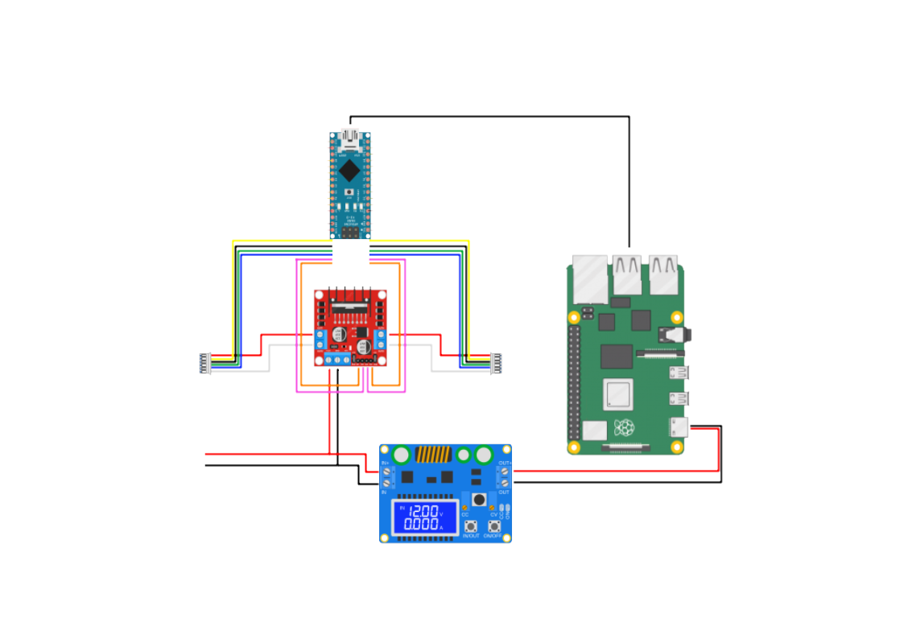
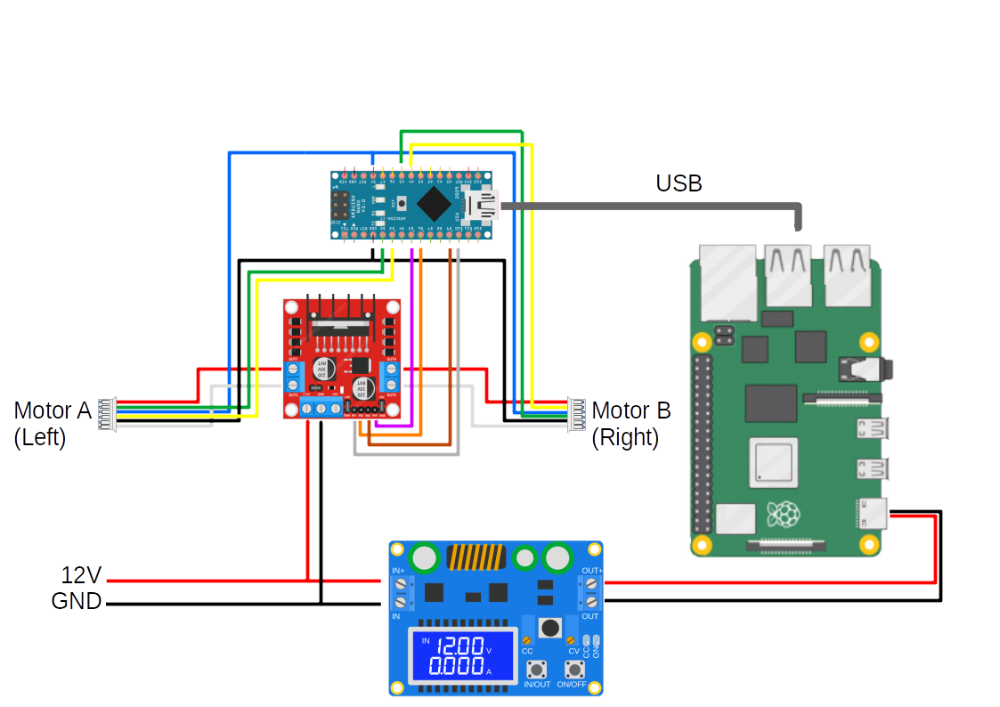

# manolobot


## Bill of Materials


| Qty. | Item                                                      | Image                                                        | Description                                                  | Link                                                         | Price         |
| ---- | --------------------------------------------------------- | ------------------------------------------------------------ | ------------------------------------------------------------ | ------------------------------------------------------------ | ------------- |
| 2    | [12V DC  encoder motor kit](./BOM/motor_kit.md)           |  | 12V DC motor JGA25-371 with encoder, 130rpm reductor, 65mm wheel, coupling, mounting bracket | [Amazon](https://www.amazon.es/dp/B07WT22RNK?psc=1&ref=ppx_pop_dt_b_asin_title) | 30,33€        |
| 1    | [Raspberry Pi 4B](./BOM/RPi_4B.md)                        |  |                                                              | [Amazon]()                                                   |               |
| 1    | [Arduino Nano V3](./BOM/arduino_nano.md)                  |             | AZDelivery Nano V3.0 with ATmega328 Chip CH340 soldered version with USB cable (Arduino Nano V3 clone) | [Amazon](https://www.amazon.es/gp/product/B01MS7DUEM/ref=ppx_yo_dt_b_asin_title_o00_s00?ie=UTF8&th=1) | 18,99€        |
| 1    | Arduino Nano Shell                                        |           |                                                              | [Amazon](https://www.amazon.es/gp/product/B08T1ZXS7K/ref=ppx_yo_dt_b_asin_title_o00_s01?ie=UTF8&th=1) | 6,99€         |
| 1    | [L298N Motor driver](./BOM/motor_driver.md)               |             |                                                              | [Amazon](https://www.amazon.es/gp/product/B077NY9RY6/ref=ppx_yo_dt_b_asin_title_o00_s01?ie=UTF8&psc=1) | 9,99€ (2 uds) |
| 1    | [35W Buck-Boost DC Converter](./BOM/buck_converter.md)    |         | ARCELI Buck-Boost Converter with display, DC 5.5-30V 12v to DC 0.5-30V  35W | [Amazon](https://www.amazon.es/gp/product/B07MY399GQ/ref=ppx_yo_dt_b_asin_title_o02_s00?ie=UTF8&psc=1) | 12,99€        |
| 1    | [5" 800x480 Resistive  Touchscreen](./BOM/touchscreen.md) |    | Waveshare 5" HDMI LCD 800x480 Resistive Touchscreen TFT Display  with Case for Raspberry Pi 4 | [Amazon](https://www.amazon.es/dp/B07PLF8V8Y?psc=1&ref=ppx_pop_dt_b_product_details) | 52,99€        |
| 1    | [DTOF Lidar LD06](./BOM/LD06-lidar.md)                    |                 | LD06 Lidar, came bundled with Minipupper                     | [Amazon](https://www.amazon.es/innomaker-integrado-omnidireccional-resistencia-LiDAR_LD06/dp/B08GJJX41D/ref=cm_cr_arp_d_product_top?ie=UTF8) | 99,99€        |
| 1    | [Pi Camera](./BOM/pi_camera.md)                           |                   | Pi Camera v1.3 with acrilic support                          |                                                              |               |
| 1    | [Gamepad](./BOM/gamepad.md)                               |                              | PS4-compatible Bluetooth game controller. Mine came bundled with Minipupper | [Fnac](https://www.fnac.es/mp8198387/Mando-USB-con-cable-Smart-Gamepad-para-PC-PS4/w-4?oref=98dfe269-3c11-af3c-116a-61fe4db3ab7a) | 17,90€        |
| 1    | [Chassis](./BOM/chassis.md)                               |                          | Based on a 29 x 19 x 12.4 cm Keeeper Hubert + Hilda plastic storage box with tray, used for the chassis of the robot. I purchased mine in the local Leroy Merlin. | [Amazon](https://www.amazon.de/keeeper-Hubert-Hilda-Storage-Transparent/dp/B092JKYLW5?ref_=ast_sto_dp) | 8,63€         |
| 1    | [Battery](./BOM/battery.md)                               |                          | HRB Battery RC LiPo 5000mAh 11.1V 3S 50C XT60 Connector with 4 adapter parts. 308 g. | [Amazon](https://www.amazon.es/gp/product/B086JP7PCC/)       | 35,99€        |
| 1    | Balance charger                                           |                      | WANGCL IMAX B6AC Lipo Battery charger B6 80W Digital LCD Lipo Cargador  11-18V con adaptador para plomo ácido NI-CD/NI-MH 1-6S LI-PO | [Amazon](https://www.amazon.es/gp/product/B0B3GM8KX9/)       | 42,99€        |
| 1    | [Mega4 USB Hub](./BOM/mega4.md)                           |                            | UUGEAR MEGA4: 4-Port USB 3.1 PPPS Hub for Raspberry Pi 4B    | [The Pi Hut](https://thepihut.com/products/mega4-4-port-usb-3-1-ppps-hub-for-raspberry-pi-4) | £29,00        |

## First prototype (20/11/22)

- 12V from bench power source
- A split takes the 12V to the buck converter and the motor driver.
- Buck converter takes 12V at IN+ /IN- and yields 5V at OUT+/OUT- to power the RPi
- RPi takes 5V at pin 4 (5V)/ pin 6(GND) - [How do I power my Raspberry Pi](https://robocraze.com/blogs/post/how-do-i-power-my-raspberry-pi)
- Arduino Nano powered from RPi via USB
- Motor Driver is powered by 12V at 12V/GND pins. 5V jumper is installed, 5V terminal not connected - Could I use this to power the RPi?
- OUT1/OUT2 are connected to the Red/White of the motor. The remaining 4 cables of the encoder are disconnected.
- Connecting the IN1 / IN2 to 5V (e.g. to the 5V pin of the Arduino Nano, cfr. [the Nano pinout in this tutorial](https://diyi0t.com/arduino-nano-tutorial/)) makes the Motor rotate CV / CCV  


### Shutting down

Before switching off the power supply, SSH into the RPi to shut it down:

```bash
(RPi) $ sudo shutdown -h now
```

Note: Powering the adafruit USB hub https://forums.adafruit.com/viewtopic.php?p=930206&hilit=external+power+usb+hub#p930206

## Prototype status (4/12/22)

- installed fuse and switch
- replaced split with AWG22 cable
- installed second motor
- connected Pi camera, LD06 lidar and LCD screen
- made a USB-C pigtail to connect RPi (powering from pins cannot run accesories)
- ordered spacers, USB-C pigtails, a flat HDMI cable and a USB hub

## Prototype status (28/12/22)

* installed flat HDMI cable, USB-C pigtail
* discarded USB hub (not needed)




## Controlling the motors with a joystick (4/1/23)

Code: [./code/arduino/motor_joystick/motor_joystick.ino](./code/arduino/motor_joystick/motor_joystick.ino) 

The script was originally inspired on [this example code for the joystick](https://www.luisllamas.es/arduino-joystick/) and [this script for controlling motors](https://lastminuteengineers.com/l298n-dc-stepper-driver-arduino-tutorial/), and later refined with [this implementation](https://howtomechatronics.com/tutorials/arduino/arduino-dc-motor-control-tutorial-l298n-pwm-h-bridge/) (using [Arduino's map() function](https://www.arduino.cc/reference/en/language/functions/math/map/) ) and [this discussion on translating joystick positions to motor speeds](https://coderdojoathenry.org/2019/02/24/hackers-how-to-control-a-robots-wheel-motors-based-on-joystick-movements/).

Notes:

* For motors A and B connect only motor voltage (WHITE, RED) to the motor driver L298N, keeping encoder disconnected (BLUE,GREEN, BLACK,YELLOW)
* In the motor driver L298N, remove the brakers in ENA and ENB 
* Connect as per following table and diagram:

| Description | Component pin | Arduino pin |
| ------- | ---- | ---- |
| Motor A speed (analog) | ENA  | D9   |
| Motor A direction | IN1 | D8 |
| Motor A direction | IN2 | D7 |
| Motor B speed (analog) | ENB | D3 |
| Motor B direction | IN3 | D5 |
| Motor B direction | IN4 | D4 |
| Joystick: command rotation (analog) | VRX | A0 |
| Joystick: command forward / backward motion (analog) | VRY | A1 |


* Analog output of VRX, VRY is in the range 0 - 1023. 
* Analog input of ENA and ENB in the range 0-255. 
* To change direction of rotation of Motor A reverse input to IN1 - IN2  from HIGH - LOW to LOW - HIGH
* Idem for Motor B, IN3, IN4

The script allows to control the motors with the joystick. Moving the stick in the Y direction turns both wheels forward / backward. Moving the stick in X direction moves the wheels in opposite directions to make the robot turn. The script also prints output through serial. 

## `miniterm` to monitor serial in the Arduino from the laptop (and through the RPi)

1. install `miniterm` in PC and RPi

```bash
$ sudo apt install python3-serial
```

2. add the user to the dialout group:

```bash
$ sudo adduser mhered dialout
```

3. usage:

```bash
$ miniterm

--- Available ports:
---  1: /dev/ttyAMA0         'ttyAMA0'
---  2: /dev/ttyUSB0         'USB2.0-Ser!'
--- Enter port index or full name: 2
--- Miniterm on /dev/ttyUSB0  9600,8,N,1 ---
--- Quit: Ctrl+] | Menu: Ctrl+T | Help: Ctrl+T followed by Ctrl+H ---
(X, Y): (508, 517) | motorA: 0% | motorB: 1%
(X, Y): (510, 517) | motorA: 0% | motorB: 1%
(X, Y): (510, 517) | motorA: 0% | motorB: 1%
(X, Y): (510, 516) | motorA: 0% | motorB: 1%
(X, Y): (510, 22) | motorA: -96% | motorB: -95%
(X, Y): (493, 0) | motorA: -100% | motorB: -96%
(X, Y): (510, 517) | motorA: 0% | motorB: 1%
(X, Y): (510, 1023) | motorA: 99% | motorB: 100%
(X, Y): (510, 1022) | motorA: 99% | motorB: 100%
(X, Y): (1023, 1023) | motorA: 100% | motorB: 0%
(X, Y): (1023, 850) | motorA: 100% | motorB: -34%
(X, Y): (1023, 517) | motorA: 100% | motorB: -99%
(X, Y): (661, 517) | motorA: 29% | motorB: -28%
(X, Y): (0, 517) | motorA: -99% | motorB: 100%
(X, Y): (0, 517) | motorA: -99% | motorB: 100%
...
```

Note: to stop `miniterm` with a Spanish keyboard press  `Ctrl + Alt Gr + ]` 

## VS Code Remote and Arduino extensions

Check out this video on how to write and upload to arduino from the laptop and through the RPi: https://www.youtube.com/watch?v=2BJ-iJF04VA

Highlights of the installation:

* Copy & Paste **only** the path of the folder where the `arduino` executable is, e.g. in the case below paste only `/home/mhered/Applications/arduino-1.8.19/`:

`````bash
$ ls -l `which arduino`
lrwxrwxrwx 1 root root 48 Sep  9 02:02 /usr/local/bin/arduino -> /home/mhered/Applications/arduino-1.8.19/arduino
`````

* No need to select a programmer, see [here](https://support.arduino.cc/hc/en-us/articles/6125080065820-Select-programmer-in-Arduino-IDE)
* Edit `.vscode/arduino.json` to add `"output":"build"` to avoid the message that it cannot use precompiled files

Highlights of the usage:

* To launch **Remote SSH** click in the green square in the bottom left corner of VS Code, select **Connect to Host** and select the host, then enter the password
* Every new session: Open the Command panel with  `Ctrl + Shift + P` then start typing "Select" for **Arduino: Select Sketch**. The file `.vscode/arduino.json` stores the selection of `port`, `sketch`, `board`, `configuration`, `output` otherwise select manually in the lower blue bar.
* To compile: command **Arduino: Verify**. Monitor progress on the OUTPUT / Arduino window. Wait for it to finish before uploading.
* To flash: command **Arduino: Upload**. Wait for compile to complete before uploading. Does not work if `miniterm` is running.
* To monitor serial: use `miniterm` in a new Terminal

## Chassis (7/1/23)

* First test on the chassis


  

* All aboard! - including the rubber duckie


## Details (12/1/23)

* Adding details: casters, grommets, a switch...


  

* All the electronics back in


## Order in the house (17/1/23)

* Some order inside the chassis:


## Selfie  (21/1/23)

* A selfie to celebrate that the camera onboard the `manolobot_uno ` is broadcasting!


## Prototype status (29/01/23)

* Screen, safe reset/shutdown button and 3D printed camera support


## Running motors from the PC (31.01.23)

1. Clone `ROSArduinoBridge` from https://github.com/joshnewans/ros_arduino_bridge.git to `./code/arduino/` - removed the `.git` folder to disconnect it from original repo
2. Upload software to the Arduino
3. Rewire Arduino:

| Description                                                  | From | To                                          |
| ------------------------------------------------------------ | ------ | ------ |
| Motor A (Left) , power + (can be reversed with Red to move motor forward and reverse) | Motor A (Left) , Red | L298, OUT1 |
| Motor A (Left), power - (can be reversed with Red to move motor forward and reverse) | Motor A (Left) , White | L298, OUT2 |
| Motor B (Right), power + (can be reversed with Red to move motor forward and reverse) | Motor B (Right), Red | L298, OUT4 |
| Motor B (Right), power - (can be reversed with Red to move motor forward and reverse) | Motor B (Right), White | L298, OUT3 |
| Motor A (Left) direction      | L298, IN1 | Arduino, D10 |
| Motor A (Left) direction      | L298, IN2 | Arduino, D6 |
| Motor B (Right) direction      | L298, IN3 | Arduino, D9 |
| Motor B (Right) direction      | L298, IN4 | Arduino, D5 |


4. Run `miniterm` to test it (`-e` for interactive and specify the baud rate or it won't work at 9600):

```bash
(RPi):$ $ miniterm -e /dev/ttyUSB0 57600
--- Miniterm on /dev/ttyUSB0  57600,8,N,1 ---
--- Quit: Ctrl+] | Menu: Ctrl+T | Help: Ctrl+T followed by Ctrl+H ---
o 150 150
OK
o -200 200
OK
--- exit ---
```


## With encoders

Wiring:



| Description                                                  | From | To                                          |
| ------------------------------------------------------------ | ------ | ------ |
| Motor A (Left) , power + (can be reversed with Red to move motor forward and reverse) | Motor A (Left) , Red | L298, OUT1 |
| Motor A (Left), Encoder power - (Voltage range 3.3-5V. Positive and negative can not be connected incorrectly) | Motor A (Left) , Black | Arduino, GND |
| Motor A (Left), Encoder A phase signal feedback (11 signals per turn of the motor) | Motor A (Left) , Yellow | Arduino, D3 |
| Motor A (Left), Encoder B phase signal feedback (11 signals per turn of the motor) | Motor A (Left) , Green | Arduino, D2 |
| Motor A (Left), Encoder power supply + (Voltage range 3.3-5V. Positive and negative can not be connected incorrectly) | Motor A (Left) , Blue | Arduino, 5V |
| Motor A (Left), power - (can be reversed with Red to move motor forward and reverse) | Motor A (Left) , White | L298, OUT2 |
| Motor B (Right), power + (can be reversed with Red to move motor forward and reverse) | Motor B (Right), Red | L298, OUT4 |
| Motor B (Right), Encoder power - (Voltage range 3.3-5V. Positive and negative can not be connected incorrectly) | Motor B (Right), Black | Arduino, GND |
| Motor B (Right), Encoder A phase signal feedback (11 signals per turn of the motor) | Motor B (Right), Yellow | Arduino, A4 |
| Motor B (Right), Encoder B phase signal feedback (11 signals per turn of the motor) | Motor B (Right), Green | Arduino, A5 |
| Motor B (Right), Encoder power supply + (Voltage range 3.3-5V. Positive and negative can not be connected incorrectly) | Motor B (Right), Blue | Arduino, 5V |
| Motor B (Right), power - (can be reversed with Red to move motor forward and reverse)e | Motor B (Right), White | L298, OUT3 |
| Motor A (Left) direction      | L298, IN1, Green | Arduino, D10 |
| Motor A (Left) direction      | L298, IN2, Yellow | Arduino, D6 |
| Motor B (Right) direction      | L298, IN3, Orange | Arduino, D9 |
| Motor B (Right) direction      | L298, IN4, Red | Arduino, D5 |

## Calibration

`encoder_cpr` empirically estimated as 1975 encoder counts / revolution

`loop_rate` (or `PID_RATE`) is set to 30 Hz (PID loops/s)

To set a wheel speed of R rev/s we send to the closed loop a command in counts per PID loop so: 

(R rev/s) * (1975 counts/rev) /(30 PID loops/s) = 1975/30R counts/PID loop = 66 R counts/PID loop

i.e. to rotate both wheels forward at 1 rev/s: `m 66 66`

to rotate both wheels backwards at 2 rev/s: `m 132 132`

etc

## Teleoperation

Teleoperation is about sending command signals to the robot, and receiving sensor feedback from the robot.

Roadmap:

- Demo GUI ROS node
- `teleop_twist_keyboard` with `ros2_control`
- teleop with a gamepad
- teleop with a phone

### Demo GUI ROS node

1. In the RPi clone the repo and symlink to src, build and source:

```bash
(RPi): $ cd ~/git/ && git clone https://github.com/joshnewans/serial_motor_demo.git
(RPi): $ ln -s ~/git/serial_motor_demo/ ~/dev_ws/src/
(RPi): $ colcon build --symlink-install
(RPi): $ cd ~/dev_ws/
(RPi): $ source install/setup.bash
```

2. Run the driver node in the RPi:

```bash
(RPI):$ ros2 run serial_motor_demo driver --ros-args -p serial_port:=/dev/ttyUSB0 -p baud_rate:=57600 -p loop_rate:=30 -p encoder_cpr:=1975
Connecting to port /dev/ttyUSB0 at 57600.
Connected to Serial<id=0xffff80b8ec40, open=True>(port='/dev/ttyUSB0', baudrate=57600, bytesize=8, parity='N', stopbits=1, timeout=1.0, xonxoff=False, rtscts=False, dsrdtr=False)
Error: Serial timeout on command: e

```

3. Repeat the process in the PC and run the GUI:

```bash
(PC): $ cd ~/git/ && git clone https://github.com/joshnewans/serial_motor_demo.git
(PC): $ ln -s ~/git/serial_motor_demo/ ~/dev_ws/src/
(PC): $ colcon build --symlink-install
(PC): $ cd ~/dev_ws/
(PC): $ source install/setup.bash

(PC):$ ros2 run serial_motor_demo gui
```


### Teleop with the keyboard (`teleop_twist_keyboard` and `ros2_control`)

cfr:

* https://articulatedrobotics.xyz/mobile-robot-12-ros2-control/

* https://articulatedrobotics.xyz/mobile-robot-12a-ros2-control-extra/

* https://articulatedrobotics.xyz/mobile-robot-13-ros2-control-real/

### Teleop with a gamepad

See details in [./BOM/gamepad.md](./BOM/gamepad.md)

It is possible to connect a gamepad to the PC and fwd the commands to the robot (easier to setup for both simulated and real robot) or directly connect it to the robot (lower latency and better perfo). Can also set up both.

A `joy_node` node talks to the joystick driver and publishes `/joy` messages with the commands

Other nodes subscribe and take actions. In particular `teleop_twist_joy` calculates and publishes `Twist` messages with velocities to `/cmd_vel` topic.

### Teleop with a phone


## To do

- [x] connect motors 
- [x] install and test basic motor software
- [x] configure and test camera
- [x] configure and test lidar
- [x] purchase and install battery
- [x] soft powerdown button
- [x] USB hub
- [x] solve issues with screen
- [x] 3D printed parts
- [x] connect and test encoders
- [x] command motor through ROS 
- [ ] `ros2_control`
- [ ] improve layout of components inside chassis
- [ ] configure face in screen
