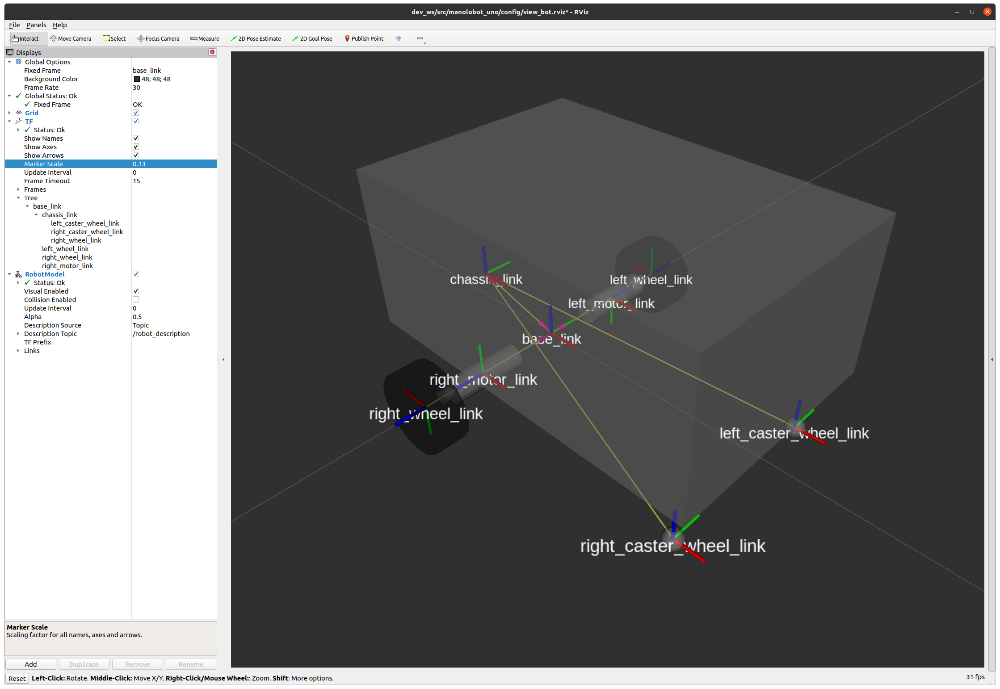

# Prerequisites

- [x] installed ROS (See video [Getting Ready for ROS Part 3: Installing ROS](https://articulatedrobotics.xyz/ready-for-ros-3-installing-ros/) and cfr. my notes in [Part-1-Getting-ready-ROS2-Aug22-Jan23.md](Part-1-Getting-ready-ROS2-Aug22-Jan23.md))

- [x] watched Intro video [Why do I think you should build this robot?](https://www.youtube.com/watch?v=OWeLUSzxMsw&t=0s)

  - [x] copied template from github: https://github.com/joshnewans/my_bot, created a workspace and built with colcon:
  
  ```bash
  $ cd ~ 
  $ mkdir dev_ws && cd dev_ws
  $ mkdir src && cd src
  $ git clone https://github.com/mhered/manolobot_uno.git
  $ cd ..
  $ colcon build --symlink-install
  ```
  
- [x] watched TF overview video: [ROS Transform System (TF) | Getting Ready to Build Robots with ROS #6](https://www.youtube.com/watch?v=QyvHhY4Y_Y8&t=0s). See my notes in [Part-1-Getting-ready-ROS2-Aug22-Jan23.md](Part-1-Getting-ready-ROS2-Aug22-Jan23.md)

  * [x] installed xacro and joint state publisher GUI

- [x] watched URDF Overview video [How do we describe a robot? With URDF! | Getting Ready to build Robots with ROS #7](https://www.youtube.com/watch?v=CwdbsvcpOHM). See my notes in [Part-1-Getting-ready-ROS2-Aug22-Jan23.md](Part-1-Getting-ready-ROS2-Aug22-Jan23.md)

# Describing the robot in URDF



Video: [Creating a rough 3D model of our robot with URDF](https://youtu.be/BcjHyhV0kIs) 
Blog: [Making a Mobile Robot #2 - Concept Design URDF](https://articulatedrobotics.xyz/mobile-robot-2-concept-urdf/) 
Discussion: [Discourse](https://discourse.articulatedrobotics.xyz/t/discussion-concept-design-urdf-making-a-mobile-robot-pt-2/27) 

---

* root link must be called `base_link`
* orientation is:

  - x forward (red)

  - y left (green)

  - z up (blue)

3 things to take into consideration when saving changes in URDF:

1. build workspace with `$ colcon build --symlink-install`. This avoids having to rebuild with every change (except if you add new files)

2. quit (ctrl+c) and relaunch the robot state publisher with. `$ ros2 launch manolobot rsp.launch.py`every time you make a change

3. click **Reset** to refresh RVIZ so it picks up changes. If this does not work tick/untick display items or close/reopen as last resource

1. To get started, go to the workspace and source it:

```bash
(Terminal 1):$ cd dev_ws
$ source install/setup.bash
```

2. With every change run the launch file:

```bash
$ ros2 launch manolobot_uno rsp.launch.py
```

If new files are present rebuild the workspace with `colcon` before the launch file:

```
$ colcon build --symlink-install
```

3. to view run RVIZ in another terminal

```bash
(Terminal 2):$ rviz2 -d dev_ws/src/manolobot_uno/config/view_bot.rviz
```

4. to publish dynamic joints run `joint_state_publisher_gui` in another terminal 

```bash
(Terminal 3):$ ros2 run joint_state_publisher_gui joint_state_publisher_gui
```

To save the state of RVIZ: Save as... in `./config/view_bot.rviz` then open rviz with the rviz file as parameter:

```bash
$ rviz2 -d dev_ws/src/manolobot_uno/config/view_bot.rviz
```

# Merging `manolobot_uno` into the main repo `manolobot` 

Based on **The good way to download code from internet**, see [notes on ETH Zurich course](https://github.com/mhered/ROS-notes/blob/main/ROS-notes/ROS_ETH_Zurich_L1.md). 

Rather than having multiple repos I copy the folder into the main one and symlink to `dev_ws/src`. 

This is way cleaner:

1. copy the contents of the repo to a folder inside `manolobot`

```bash
$ mv ~/dev_ws/src/manolobot_uno ~/manolobot/
```

2. Symlink it to `dev_ws`

```bash
$ ln -s ~/manolobot/manolobot_uno/ ~/dev_ws/src/
```

3. Build it and re-source environment

```bash
$ colcon build --symlink-install
$ cd ~/dev_ws
$ source install/setup.bash
```

4. Then, to launch the `robot_state_publisher`:

```bash
$ ros2 launch manolobot_uno rsp.launch.py
```

# Simulating the robot in Gazebo

Blog: https://articulatedrobotics.xyz/mobile-robot-3-concept-gazebo/

Check also: https://articulatedrobotics.xyz/ready-for-ros-8-gazebo/

1. Launch `robot_state_publisher` with sim time:

```bash
(Terminal 1):$ ros2 launch manolobot_uno rsp.launch.py use_sim_time:=true
```

2. Install - if not done before - and launch gazebo with ROS compatibility:

```bash
$ sudo apt install ros-foxy-gazebo-ros-pkgs
(Terminal 2):$ ros2 launch gazebo_ros gazebo.launch.py
```

3. Spawn the robot:

```bash
(Terminal 3):$ ros2 run gazebo_ros spawn_entity.py -topic robot_description -entity manolobot
```

Prepared  [launch_sim.launch.py](./manolobot_uno/launch/launch_sim.launch.py) to achieve the same effect (launch gazebo and spawn the robot) but with a single command:

```bash
(Terminal 1):$ ros2 launch manolobot_uno launch_sim.launch.py
```

* Created`gazebo_control.xacro` , a new file with the configuration of the `diff_drive` plugin for gazebo

* Properties definition (robot dimensions etc) need to be used now as well by `gazebo_control.xacro` so I moved their definition from `robot_core.xacro` to a separate file `properties.xacro`  and included it from `robot.urdf.xacro`.

* Modified `robot.urdf.xacro`to add calls to both `properties.xacro` and `gazebo_control.xacro`

* Modified `robot_core.xacro`:

  * added gazebo tags to define colors for each link

  * added very low friction coefficients mu1 mu2 for caster wheels

With this it is possible to control the robot in the simulation using `teleop_key`:

```bash
(Terminal 2):$ ros2 run teleop_twist_keyboard teleop_twist_keyboard
```

* Adjusted the masses to get a proper behavior of the simulation. **Note: the values are not real ones, need to make measurements!!**
* Created launch file `joystick.launch` and parameter file `joystick.yaml` to configure and launch support for PS4 gamepad as follows: 
  *  Dead man switches: L button (left shoulder) for normal speed, R button (right shoulder) for turbo
  * Control on left stick: vertical axis for forward/backward motion and horizontal axis for rotation. 
* See details of the setup of the gamepad in [./BOM/gamepad.md](./BOM/gamepad.md)

Launch with:

```bash
(Terminal 2):$ ros2 launch manolobot_uno joystick.launch.py
```

* Driving `manolobot_uno` around in Gazebo:


# Tips & tricks

* to open Gazebo in a world:

```bash
(Terminal 1):$ ros2 launch manolobot_uno launch_sim.launch.py world:=./src/manolobot_uno/worlds/cones.world use_sim_time:=true
```

* to force Gazebo to update changes in the model: close all other terminals, source, if necessary kill hung up processes with:

```bash
$ sudo killall -9 gazebo gzserver gzclient
```


