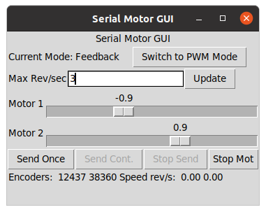

# Teleoperation

Teleoperation is about sending command signals to the robot, and receiving sensor feedback from the robot.

Roadmap:

- Demo GUI ROS node
- `teleop_twist_keyboard` with `ros2_control`
- teleop with a gamepad
- teleop with a phone

## Demo GUI ROS node

1. In the RPi clone the repo and symlink to src, build and source:

```bash
(RPi): $ cd ~/git/ && git clone https://github.com/joshnewans/serial_motor_demo.git
(RPi): $ ln -s ~/git/serial_motor_demo/ ~/dev_ws/src/
(RPi): $ cd ~/dev_ws/
(RPi): $ colcon build --symlink-install
(RPi): $ source install/setup.bash
```

2. Run the driver node in the RPi:

```bash
(RPI):$ ros2 run serial_motor_demo driver --ros-args -p serial_port:=/dev/ttyUSB0 -p baud_rate:=57600 -p loop_rate:=30 -p encoder_cpr:=1975
Connecting to port /dev/ttyUSB0 at 57600.
Connected to Serial<id=0xffff80b8ec40, open=True>(port='/dev/ttyUSB0', baudrate=57600, bytesize=8, parity='N', stopbits=1, timeout=1.0, xonxoff=False, rtscts=False, dsrdtr=False)
Error: Serial timeout on command: e

```

3. Repeat the process in the PC and run the GUI:

```bash
(PC): $ cd ~/git/ && git clone https://github.com/joshnewans/serial_motor_demo.git
(PC): $ ln -s ~/git/serial_motor_demo/ ~/dev_ws/src/
(PC): $ colcon build --symlink-install
(PC): $ cd ~/dev_ws/
(PC): $ source install/setup.bash

(PC):$ ros2 run serial_motor_demo gui
```



## Teleop with the keyboard (`teleop_twist_keyboard` and `ros2_control`)

cfr: https://articulatedrobotics.xyz/mobile-robot-12-ros2-control/

cfr: https://control.ros.org/master/index.html

Using ROS topics is not fast enough

`ros2_control` is faster (loads libraries) and allows writing modular reusable code


### Controller manager

**Controller manager** connects hardware drivers with control algorithms using plugins

2 ways to run it:

* normally you use the one provided `controller_manager/ros2_control_node`
* you may want to write your own node of class `controller_manager::ControllerManager`

Provide info about the hardware interfaces via the URDF file and the controllers via a YAML parameters file

Interacting with the controller manager:

* via ROS services
* via `ros2_control` CLI tool that simplifies the calls to these services
* via specialized nodes and scripts

### Hardware interfaces 

**Hardware interfaces or components** are pieces of software that speak to the hardware and expose it in the standard of `ros2_control`. They represent the hardware through **Command interfaces** (read/write, things we can control in the robot, e.g. motor velocity) and **State interfaces** (read only, things we can only monitor, e.g. wheel position and velocity, battery level, temperature, etc)

A robot may have multiple hardware components. The **controller manager** uses the **resource manager** to gather all the hardware interfaces and exposes them together so the controller manager sees a long list of command and state interfaces. We include `ros2_control` tags in the URDF to list the hardware interfaces (plugins) the resource manager must load.

### Controllers

The way we interact with `ros2_control` listen for input e.g. gamepad or navigation path planner

They listen for some topic, calculate proper actuations and send command inputs to the hardware interfaces through controller manager and resource manager

Controllers are designed for specific robot applications, and are hardware independent. Many are provided in `ros2_controller` package. E.g. the `diff_drive_controller/DiffDriveController`

We set up the controllers through a YAML file that sets parameters

We can have several controllers provided they are not trying to command the same interfaces, but they can share state interfaces (read only)

Controllers do not need to actually control anything, can be used e.g. just to read a state interface and publish it to a ROS topic

### In practice (with gazebo)

1. Install packages:

```bash
(PC):$ sudo apt install ros-foxy-ros2-control ros-foxy-ros2-controllers ros-foxy-gazebo-ros2-control
```

2. update URDF file `./manolobot_uno/description/robot.urdf.xacro` to call `ros2_control.xacro` instead of `gazebo_control.xacro`
3. Create [`./manolobot_uno/description/ros2_control.xacro`](./manolobot_uno/description/ros2_control.xacro) and YAML parameter file `./manolobot_uno/config/my_controllers.yaml`
4. build and source
5. run with:

```bash
(PC):$ ros2 launch manolobot_uno launch_sim.launch.py world:=./src/manolobot_uno/worlds/cones.world
```

6. Check hardware interfaces are working with:

```bash
(PC):$ ros2 control list_hardware_interfaces
command interfaces
	left_wheel_joint/velocity [unclaimed]
	right_wheel_joint/velocity [unclaimed]
state interfaces
	 left_wheel_joint/position
	 left_wheel_joint/velocity
	 right_wheel_joint/position
	 right_wheel_joint/velocity
```

7. start controllers with the `spawner.py` script which will later on work nicely for a launch file

```bash
(PC):$ ros2 run controller_manager spawner.py diff_cont
```

8. To run `teleop_twist_keyboard` we need to remap `/cmd_vel` to  `/diff_cont/cmd_vel_unstamped` which is what the controller expects:

```bash
(PC):$ ros2 run teleop_twist_keyboard teleop_twist_keyboard --ros-args -r /cmd_vel:=/diff_cont/cmd_vel_unstamped
```

### In practice (fixing details)

cfr: https://articulatedrobotics.xyz/mobile-robot-12a-ros2-control-extra/

#### Increase gazebo clock rate

Robot movement is choppy because clock rate in Gazebo is too slow (10Hz). Increased to 400Hz because why not.

**Note:** After implementing the fix to increase gazebo clock rate, I get the following error message when running gazebo - even though it otherwise  seems to be working fine:

```
...
[gzserver-2] Error [parser.cc:403] Error parsing XML in file [/home/mhered/dev_ws/install/manolobot_uno/share/manolobot_uno/config/gazebo_params.yaml]: Error document empty.
...
```

If appears it is trying to interpret the `gazebo_params.yaml` file as XML and failing.

#### Reduce wheel drift

Replace wheel collision model for spheres

#### Add parameter to toggle between `gazebo_control` and `ros2_control`

Because `ros2_control` shows misbehavior at higher speeds (?)

- [x] To Do: add toggle at runtime, i.e. `$ ros2 launch my_package launch_sim.launch.py use_ros2_control:=false`

### In practice (in the actual robot)

cfr: https://articulatedrobotics.xyz/mobile-robot-13-ros2-control-real/

We want to link the command velocity (`Twist` or `TwistStamped` messages from a gamepad or Nav2 or whatever) with the actual motors in the robot.

In our case:

* we use the `diff_drive_controller` controller plugin to convert command velocities into required wheel velocities. 
* we need to write a hardware interface plugin or clone `diffdrive_arduino` by Josh Newans - this converts required wheel velocities into motor hardware commands
* The controller manager (`ros2_control_node`) links the two plugins.
* Joint State Broadcaster reads wheel encoder positions and publishes to `/joint_states`so the Robot State Publisher can publish its TFs.

1. Install the hardware interface plugin (clone and symlink the two repos, install `ros2-control`, and build):

```bash
(RPi):$ cd ~/git
(RPi):$ git clone https://github.com/joshnewans/diffdrive_arduino
(RPi):$ ln -s ~/git/diffdrive_arduino/ ~/dev_ws/src/
(RPi):$ git clone https://github.com/joshnewans/serial
(RPi):$ ln -s ~/git/serial/ ~/dev_ws/src
(RPi):$ sudo apt install ros-foxy-ros2-control ros-foxy-ros2-controllers
(RPi):$ cd ~/dev_ws
(RPi):$ colcon build --symlink-install
```

2. Configure it: first, update the URDF file `ros2_control.xacro` so it loads the hardware interface plugin `diffdrive_arduino/DiffDriveArduino` and define all the parameters. Next, create `launch_robot.launch.py` and replace the call to gazebo controller for the `controller_manager` node passing as parameters the URDF in `robot_description` and with the controller plugins in `my_controllers.yaml`. Then,  remove the use of sim time in `launch_robot.launch.py`, and `my_controller_params.yaml` . Finally, delay the launch of `controller_manager`, `diff_drive` and `joint_broad`.

## Teleop with a gamepad

See details in [./BOM/gamepad.md](./BOM/gamepad.md)

It is possible to connect a gamepad to the PC and fwd the commands to the robot (easier to setup for both simulated and real robot) or directly connect it to the robot (lower latency and better perfo). Can also set up both.

A `joy_node` node talks to the joystick driver and publishes `/joy` messages with the commands

Other nodes subscribe and take actions. In particular `teleop_twist_joy` calculates and publishes `Twist` messages with velocities to `/cmd_vel` topic.

##  Teleop with a phone
