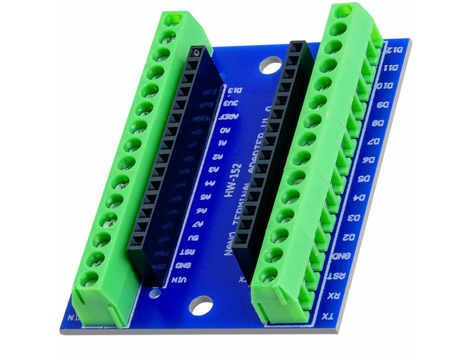

# Bill of Materials

| Qty. | Item                                                | Image                                                        | Description                                                  | Link                                                         | Price         |
| ---- | --------------------------------------------------- | ------------------------------------------------------------ | ------------------------------------------------------------ | ------------------------------------------------------------ | ------------- |
| 2    | [12V DC  encoder motor kit](./motor_kit.md)         |  | 12V DC motor JGA25-371 with encoder, 130rpm reductor, 65mm wheel, coupling, mounting bracket | [Amazon](https://www.amazon.es/dp/B07WT22RNK?psc=1&ref=ppx_pop_dt_b_asin_title) | 30,33€        |
| 1    | Arduino Nano V3                                     |               |                                                              | [Amazon](https://www.amazon.es/gp/product/B01MS7DUEM/ref=ppx_yo_dt_b_asin_title_o00_s00?ie=UTF8&th=1) | 18,99€        |
| 1    | Arduino Nano Shell                                  |             |                                                              | [Amazon](https://www.amazon.es/gp/product/B08T1ZXS7K/ref=ppx_yo_dt_b_asin_title_o00_s01?ie=UTF8&th=1) | 6,99€         |
| 1    | [L298N Motor driver](./motor_driver.md)             |               |                                                              | [Amazon](https://www.amazon.es/gp/product/B077NY9RY6/ref=ppx_yo_dt_b_asin_title_o00_s01?ie=UTF8&psc=1) | 9,99€ (2 uds) |
| 1    | [35W Buck-Boost DC Converter](./buck_converter.md)  |           | ARCELI Buck-Boost Converter with display, DC 5.5-30V 12v to DC 0.5-30V  35W | [Amazon](https://www.amazon.es/gp/product/B07MY399GQ/ref=ppx_yo_dt_b_asin_title_o02_s00?ie=UTF8&psc=1) | 12,99€        |
| 1    | [5" 800x480 Resistive  Touchscreen](touchscreen.md) |                 | 5" HDMI LCD 800x480 Resistive Touchscreen TFT Display  with Case for Raspberry Pi 4 | [Amazon](https://www.amazon.es/dp/B07PLF8V8Y?psc=1&ref=ppx_pop_dt_b_product_details) | 52,99€        |

