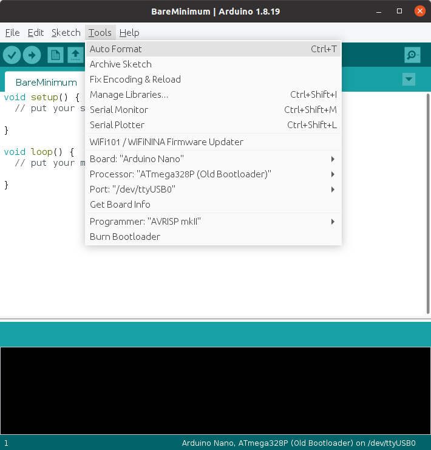
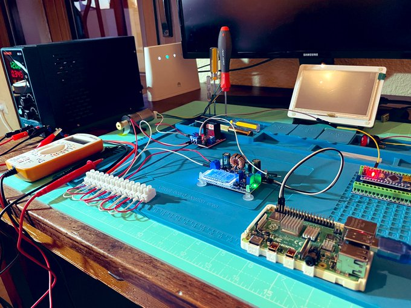

# Articulated Robotics - Getting Ready for ROS series 

[Getting ready to Build Robots with ROS youtube playlist](https://www.youtube.com/playlist?list=PLunhqkrRNRhYYCaSTVP-qJnyUPkTxJnBt)

8+1 videos covering the setup and an overview of ROS2, TF, URDF and gazebo

## (#01) What we need 

Link to blog post: [Getting Ready for ROS Part 1: What you need](https://articulatedrobotics.xyz/ready-for-ros-1-what-you-need/)

### Skills

Basic Admin: install and configure OS
Move around in Linux
Git for version tracking
Programming & Compiling
Basic electronics: programming an arduino, soldering, connecting a breadboard

### Hardware setup
How to balance small, low energy, powerful and cheap? split computing between 2 paired computers:
* a small onboard computer on the robot (RPi): takes sensor data, sends for processing over network to base station. Receives results and send signals to actuators
* a powerful off-board base station and development machine (mid-range laptop): runs algorithms for processing, takes joystick input, provides visualization and doubles as development machine for coding comfotsably

Docker and virtual machines are fiddly better full Ubuntu installation

### Software
- [x] LTS ROS 2 Foxy Fitzroy is compatible with Ubuntu 20.04 focal fossa (ubuntu mate 64 bits https://ubuntu-mate.org/download). Today latest is ROS 2 Humble and Ubuntu 22.04 Jellyfish.

- [x] version control sfw: git in both rpi and laptop

``` bash
$ sudo apt install git
```
- [x] code editor: vscode only needed on laptop

``` bash
$ sudo snap install --classic code
```
- [x] recommended install also VS code [remote development extension pack](https://code.visualstudio.com/docs/remote/ssh) to code on RPi without a screen

- [x] arduino IDE on both computers ([instructions](https://docs.arduino.cc/software/ide-v1/tutorials/Linux)):
  - [x] Download [ARM Linux 64 bits](https://downloads.arduino.cc/arduino-1.8.19-linuxaarch64.tar.xz) and [Linux 64 bits](https://downloads.arduino.cc/arduino-1.8.19-linux64.tar.xz) versions of IDE 1.8.19 from the [Arduino download page](https://www.arduino.cc/en/software)
  - [x] On laptop, extract to a suitable location e.g. `~/Applications/arduino-1.8.19/`
  - [x] From inside the folder,  run the install script that creates desktop links:
  
  ```bash
     $ sudo sh install.sh
  ```
  
  - [x] Open the IDE, under **Tools** select **Board:"Arduino Nano"**, **Processor:"ATmega328P (OldBootloader)"** and **Port:"/dev/ttyUSB0"**. Note: choosing the wrong processor gives [this error](https://support.arduino.cc/hc/en-us/articles/4401874331410#avrdude-stk500_recv-and-stk500_getsync)
  
  
  
  - [x] If it still does not connect add the user to the `dialout` group:
  
  ```
  $ ls -l /dev/ttyUSB*
  crw-rw---- 1 root dialout 188, 0 Nov 20 13:47 /dev/ttyUSB0
  $ sudo usermod -a -G dialout <username>
  ```
  
  Tested with **Blink** and **AnalogReadSerial** under **File -> Examples -> 01.Basics** 

### Other tools
- [x] 12V bench power supply
- [ ] Battery charger
- [x] Multimeter
- [x] Soldering iron and solder
- [x] Crimp tools, screwdrivers, Pliers, tieraps, screws,
- [x] rotary tool
- [ ] 3D printer

## (#02) Network setup
Link to blog post: [Getting Ready for ROS Part 2: Networking](https://articulatedrobotics.xyz/ready-for-ros-2-networking/)

Network is needed to remotely control our robot, have robots work together and split computation over multiple machines. ROS provides the protocols, we just need to ensure all computers are in the same network. Requisites:

* Fast reliable connection between robot and laptop
* Internet access to install sfw and back-up in git
* Control over the network e.g. to set up fixed IP addresses

3 options for architecture:

* Existing network: rpi and laptop connected to the router. Easy but not portable, lacks control (DHCP/static IP, network congestion, dropouts etc), may lead to ROS conflicts when using more than one robot
* Access point network: configure laptop to generate wifi network, robot connects to it. Flexible but requires effort to configure, a second wifi card, complex with more than one base computer.
* Dedicated network with a travel router. Preferred.

- [x] Install `ssh` on RPi using keyboard mouse and monitor

```bash
(RPi):$ sudo apt install openssh-server
```

- [x] Get the local IP address of RPi with

```bash
(RPi):$ ip addr
```

- [x] To access RPi terminal remotely from laptop:

```bash
(laptop):$ ssh <pi_username>@<pi_ip_address> # in particular ssh mhered@192.168.8.105

```
- [ ] Write a config file with [`netplan`](https://netplan.io) **Note: my laptop does not have Ethernet port!**

Other tools:

* `scp` for file transfer
* X forwarding to run GUIs remotely
* VS code [remote development extension pack](https://code.visualstudio.com/docs/remote/ssh)

## (#03) Install ROS

Link to blog post: [Getting Ready for ROS Part 3: Installing ROS](https://articulatedrobotics.xyz/ready-for-ros-3-installing-ros/)
Install ROS on both `laptop` and `RPi`:
- [X] Check UTF-8 is set and that the Ubuntu universe repo is enabled with: 
```bash
$ locale
...
$ apt-cache policy | grep universe
```
The second should result in something like:
```
500 http://ports.ubuntu.com/ubuntu-ports focal/universe arm64 Packages
     release v=20.04,o=Ubuntu,a=focal,n=focal,l=Ubuntu,c=universe,b=arm64
```
Note: cfr. the [ROS Foxy installation guide](https://docs.ros.org/en/foxy/Installation/Ubuntu-Install-Debians.html) if more details needed. 
- [X] Add ROS2 apt repo to the system with:
```bash
$ sudo apt update && sudo apt install curl gnupg2 lsb-release
$ sudo curl -sSL https://raw.githubusercontent.com/ros/rosdistro/master/ros.key  -o /usr/share/keyrings/ros-archive-keyring.gpg
$ echo "deb [arch=$(dpkg --print-architecture) signed-by=/usr/share/keyrings/ros-archive-keyring.gpg] http://packages.ros.org/ros2/ubuntu $(source /etc/os-release && echo $UBUNTU_CODENAME) main" | sudo tee /etc/apt/sources.list.d/ros2.list > /dev/null
```
- [X] Install `ros2` and `colcon` and add sourcing of the ROS2 environment to `~/.bashrc` with:
```bash
$ sudo apt update && sudo apt upgrade
$ sudo apt install ros-foxy-desktop
$ sudo apt install python3-colcon-common-extensions
$ echo "source /opt/ros/foxy/setup.bash" >> ~/.bashrc
$ source ~/.bashrc
```

- [X] Test communication between a node written in C++ running on the laptop and a python node running on RPi: 
```bash
(laptop:)$ ros2 run demo_nodes_cpp talker
...
[INFO] [1662750396.990408713] [talker]: Publishing: 'Hello World: 67'
[INFO] [1662750397.990414028] [talker]: Publishing: 'Hello World: 68'
[INFO] [1662750398.990288416] [talker]: Publishing: 'Hello World: 69'
...
```
```bash
(RPi:)$ ros2 run demo_nodes_py listener
...
[INFO] [1662750392.965285945] [listener]: I heard: [Hello World: 63]
[INFO] [1662750393.965151014] [listener]: I heard: [Hello World: 64]
[INFO] [1662750394.965403701] [listener]: I heard: [Hello World: 65]
...
```
Success!

## (#04) 10 concepts about ROS

Link to blog post: [Getting Ready for ROS Part 4: ROS Overview (10 concepts you need to know)](https://articulatedrobotics.xyz/ready-for-ros-4-ros-overview/)

1. ROS Distributions
2. Nodes
3. Topics and Messages
4. Services
5. Node Arguments (Parameters and Remapping)
6. Launch Files
7. Packages
8. System Install (the underlay)
9. Workspaces/Overlays
10. QoS

## (#05) Create a package

Link to blog post: [Getting Ready for ROS Part 5: Making your First Package](https://articulatedrobotics.xyz/ready-for-ros-5-packages/)

1. Create a workspace 
2. Create a package
3. Build it
4. Upload to git
5. Pull from git to the robot
6. Test it 

## First prototype (20/11/22)

### Notes

- 12V from bench power source
- A split takes the 12V to the buck converter and the motor driver.
- Buck converter takes 12V at IN+ /IN- and yields 5V at OUT+/OUT- to power the RPi
- RPi takes 5V at pin 4 (5V)/ pin 6(GND) - [How do I power my Raspberry Pi](https://robocraze.com/blogs/post/how-do-i-power-my-raspberry-pi)
- Arduino Nano powered from RPi via USB
- Motor Driver is powered by 12V at 12V/GND pins. 5V jumper is installed, 5V terminal not connected - Could I use this to power the RPi?
- OUT1/OUT2 are connected to the Red/White of the motor. The remaining 4 cables of the encoder are disconnected.
- Connecting the IN1 / IN2 to 5V (e.g. to the 5V pin of the Arduino Nano, cfr. [the Nano pinout in this tutorial](https://diyi0t.com/arduino-nano-tutorial/)) makes the Motor rotate CV / CCV  

### Diagram and overview




### Shutting down

First, SSH into the RPi to shut it down:

```bash
(RPi) $ sudo shutdown -h now
```

Then switch off the power supply
