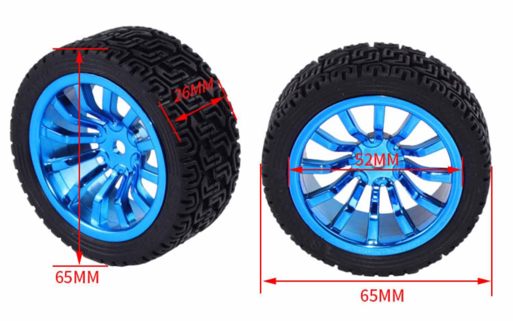
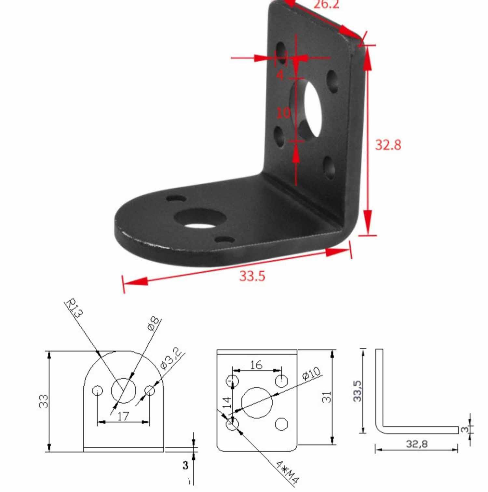
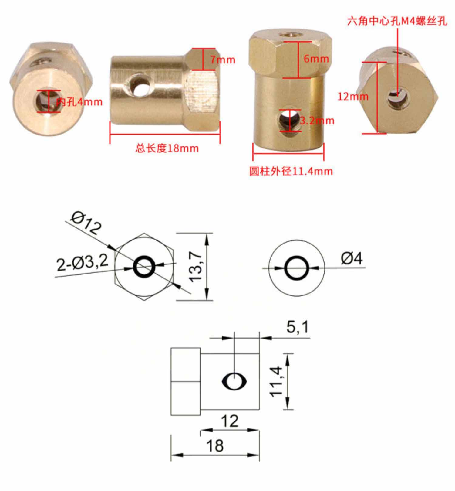
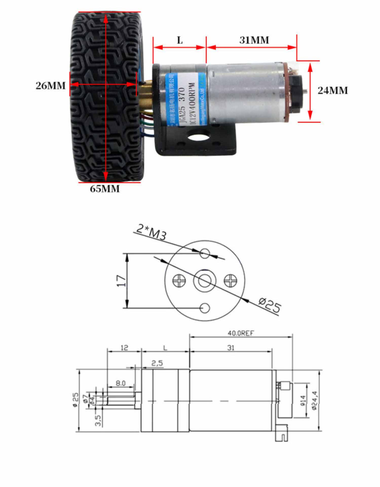
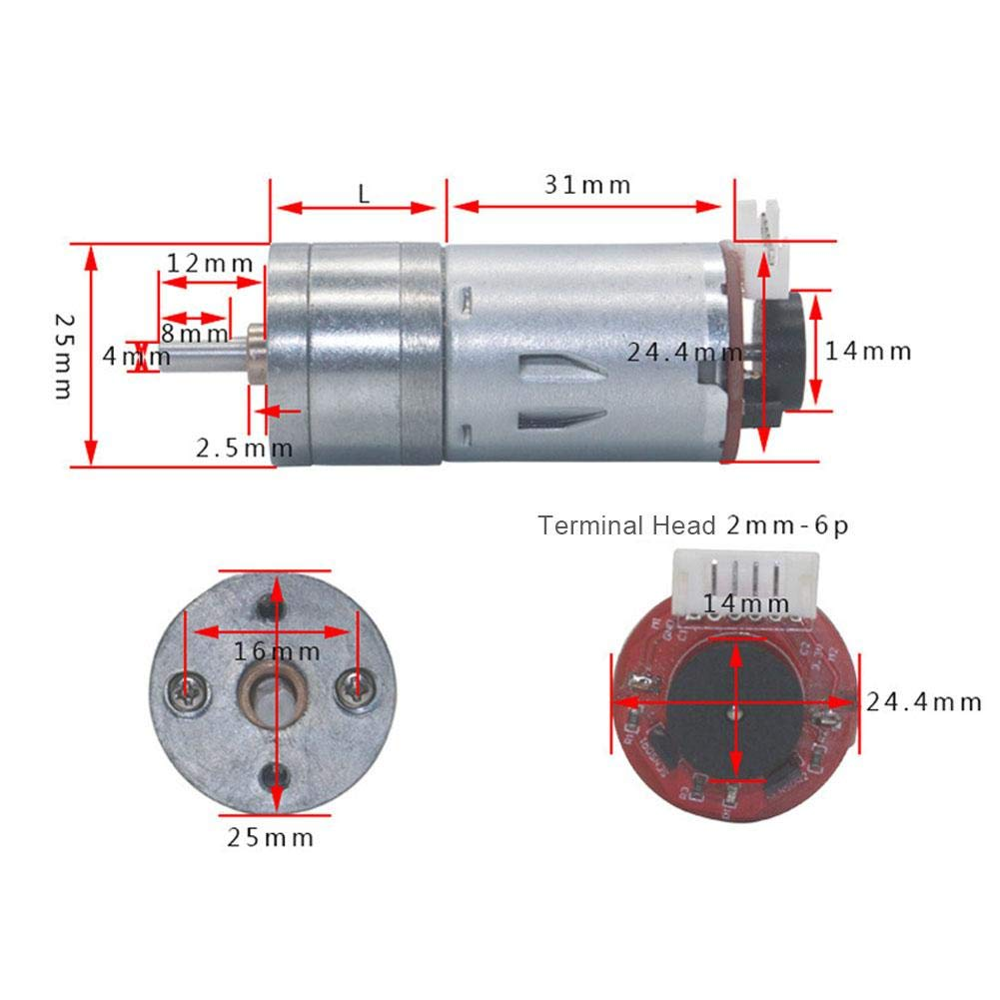
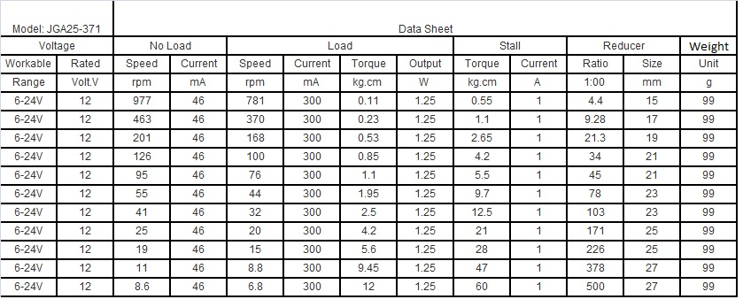
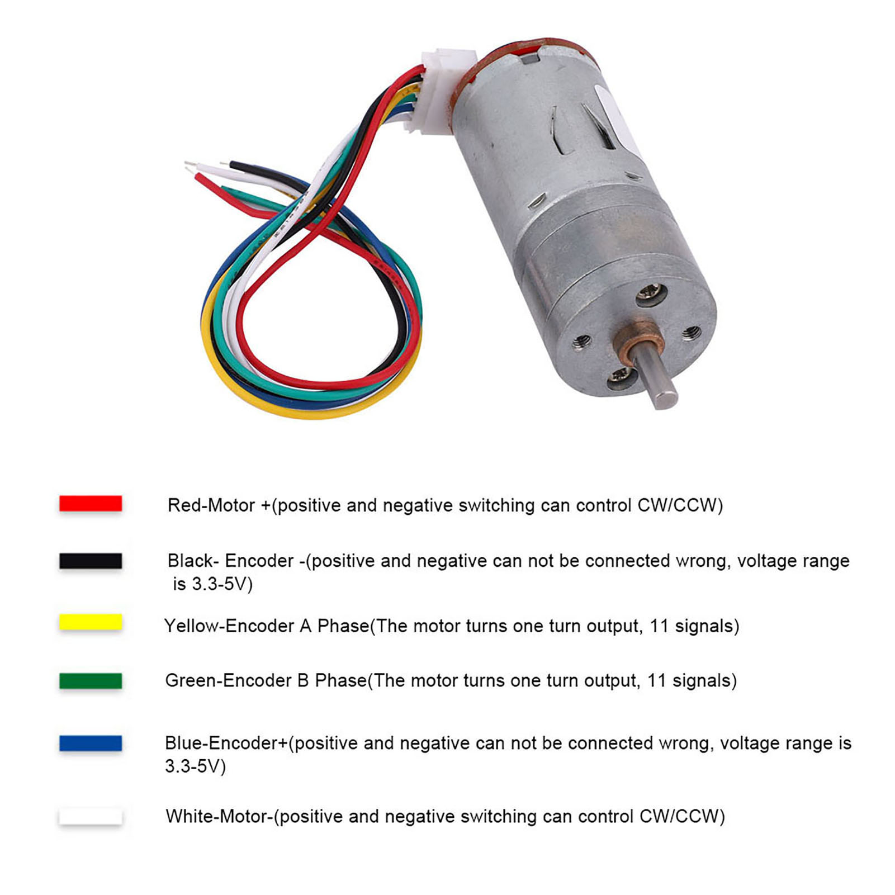

# JGA25-371 Encoder Gear Motor Kit with Mounting Bracket and Wheel

## Contents:

* 1 x JGA25-371 Encoder Gear Motor
* 1 x 65mm Diameter Rubber Tire
* 1 x Brass Coupling
* 1 x Aluminum Alloy Mounting Bracket
* 1 x Motor Cable (14.2cm)
* 1 Set of Screws

## Wheel

Diameter: 65MM 

Thickness: about 27MM

Weight: 35 grams 

Features: 

Rubber tire with a sponge liner

Nylon wheel hub for hex coupling

Tire tread pattern: imitation HPI drift pattern load capacity grip

## Mounting bracket

## Brass coupling

## Motor

[Link to Datasheet](https://www.openimpulse.com/blog/wp-content/uploads/wpsc/downloadables/JGA25-371-data-sheet1.jpg)

Datasheet not to be trusted. Measured Stall Current: ca. 1.5A

### Wiring

https://forum.arduino.cc/t/connecting-a-dc-motor-w-encoder-to-arduino-shield/517262/8

Review!!

- Red: motor power + (can be reversed with Red to move motor forward and reverse)
- Black: encoder power - (Voltage range 3.3-5V. Positive and negative can not be connected incorrectly)
- Yellow: Encoder A phase signal feedback (11 signals per turn of the motor)
- Green: Encoder B phase signal feedback (11 signals per turn of the motor)
- Blue: encoder power supply + (Voltage range 3.3-5V. Positive and negative can not be connected incorrectly)
- White: motor power - (can be reversed with Red to move motor forward and reverse) 

## Sources

* [Ebay](https://www.ebay.com/itm/165266268040?hash=item267aa31f88:g:nDMAAOSw7e9dMYIL)
* [Daraz](https://www.daraz.lk/products/jga25-371-smart-car-robot-diy-encoder-gear-motor-with-mounting-bracket-wheel-kit-i109232382.html)
* [Walmart](https://www.walmart.com/ip/Smart-Car-Kit-Small-Size-JGA25-371-Wear-resistant-For-Printers-For-Smart-Cars-For-Robots/1531668648?wmlspartner=wlpa&selectedSellerId=101094432)
* [AliExpress](https://es.aliexpress.com/item/1005003707407732.html?gatewayAdapt=glo2esp)
* [Amazon](https://www.amazon.es/dp/B07WT22RNK?psc=1&ref=ppx_pop_dt_b_product_details)
* [Openimpulse](https://www.openimpulse.com/blog/products-page/25d-gearmotors/jga25-371-dc-gearmotor-encoder-126-rpm-12-v-2/): motor only, datasheet
* [Plexishop](https://www.plexishop.it/en/robotics-and-automation/motors-for-arduino/dc-motors/jga25-371-geared-motor-with-encoder-126rpm.html#)

